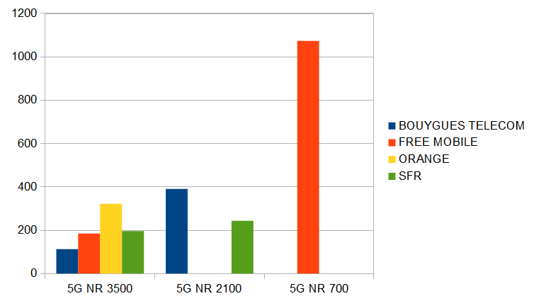
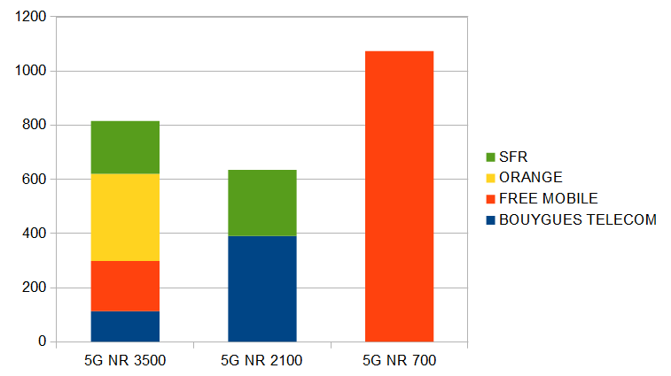
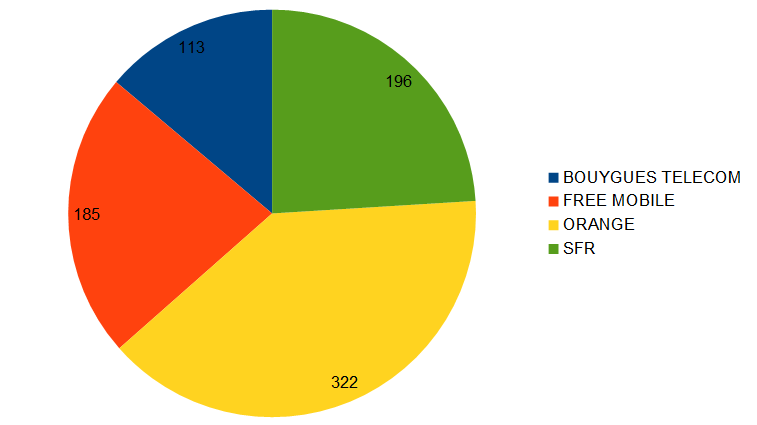
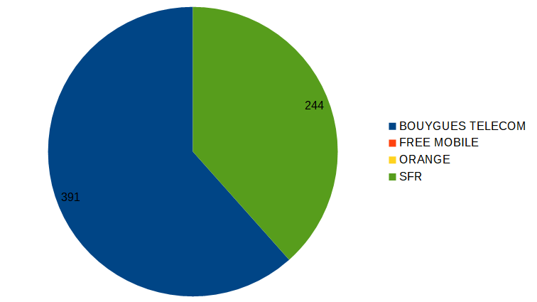
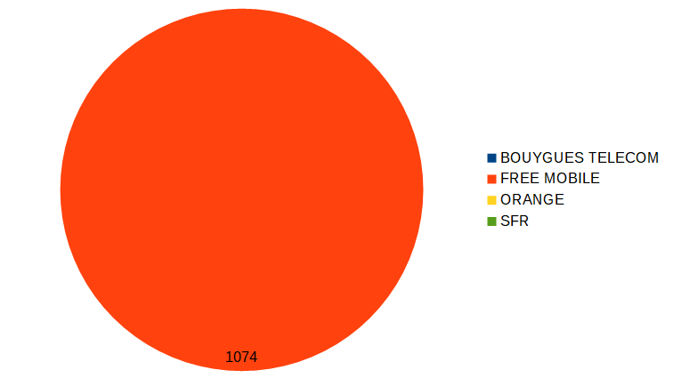

#  Compte Rendu du TP2 d'Exploitation d'une Base de Données

 Alexandre Clénet / Groupe 2
 
##  La base de données 'BASETD' sur laquelle on travaille est : 

<span style="color: #e11d1d">Distribution</span> ((**ID**, #NUMFO, #CODE_INSEE, ADRESSE, STATUT, ...);       
<span style="color: #e69138">Operateur</span> (**NUMFO**, NOMFO, GENERATION, TECHNOLOGIE);   
<span style="color: #26B260">Commune</span> (**CODE_INSEE**, NOMCOMMUNE, #NOMDEP);   
<span style="color: #e11dd6">Departement</span> (**NOMDEP**, CODE_DEPARTEMENT);   

## Liste des Requêtes :

### 1. Liste des communes qui se trouvent dans le département 49.

La première requête consiste à lier les `communes` et le `département` `49`.  

**Tables** :   <span style="color: #26B260">Commune</span> ,    <span style="color: #e11dd6">Departement</span>         
**Jointures** :  *NOMDEP*                                      
**Sortie** :      *nom_commune*                         
#### Version avec `IN` :
```sql
select co.nom_commune 
from BASETD.commune co 
where co.nomdep in (
    select nomdep 
    from BASETD.departement 
    where code_departement=49 );
```
#### Version avec `EXISTS` :
```sql
select co.nom_commune 
from BASETD.commune co 
where exists (
    select * 
    from BASETD.departement de 
    where co.nomdep=de.nomdep and code_departement=49
    );
```

### 2. Liste des noms des communes avec le nom du département qui disposent de la 5G.
La requête consiste à lier les `communes` et les `opérateurs 5G` en passant par la `distribution`.  

**Tables** :   <span style="color: #26B260">Commune</span> ,    <span style="color: #e11d1d">Distribution</span>  ,  <span style="color: #e69138">Operateur</span>     
**Jointures** :  *NUMFO*  ,  *CODE_INSEE*                                    
**Sortie** :      *nom_commune*,   *nomdep*
#### Version avec `IN` :
```sql
select distinct co.nom_commune,co.nomdep 
from BASETD.commune co 
where co.code_insee in (
    select di.code_insee 
    from BASETD.distribution di 
    where di.numfo in (
        select op.numfo 
        from BASETD.operateur op 
        where op.generation='5G'));
```

#### Version avec `EXISTS` :
```sql
select distinct co.nom_commune,co.nomdep 
from BASETD.commune co 
where exists (
    select * 
    from BASETD.distribution di,BASETD.operateur op 
    where di.numfo = op.numfo and generation='5G' and di.code_insee = co.code_insee );
```

### 3. Liste des communes avec le nom du departement qui ne possèdent pas la 5G.
La requête consiste cette fois ci à lier les `communes` et les `opérateurs hors 5G` en passant par la `distribution`.  

**Tables** :   <span style="color: #26B260">Commune</span> ,    <span style="color: #e11d1d">Distribution</span>  ,  <span style="color: #e69138">Operateur</span>     
**Jointures** :  *NUMFO*  ,  *CODE_INSEE*                                    
**Sortie** :      *nom_commune*,   *nomdep*
#### Version avec `IN` :
```sql
from BASETD.commune co 
where co.code_insee not in (
    select di.code_insee 
    from BASETD.distribution di 
    where di.numfo in (
        select op.numfo 
        from BASETD.operateur op 
        where op.generation='5G'));
```
#### Version avec `EXISTS` :
```sql
select distinct co.nom_commune,co.nomdep 
from BASETD.commune co 
where not exists (
    select * 
    from BASETD.distribution di,BASETD.operateur op 
    where di.numfo = op.numfo and generation='5G' and di.code_insee = co.code_insee );
```
### 4. Liste des communes qui ne possèdent pas la 5G et qui se trouvent dans le département 44.
La  requête est similaire à la dernière mais cette fois on lie avec le `département` `44`.

**Tables** :   <span style="color: #26B260">Commune</span> ,    <span style="color: #e11d1d">Distribution</span>  ,  <span style="color: #e69138">Operateur</span>  , <span style="color: #e11dd6">Departement</span>   
**Jointures** :  *NUMFO*  ,  *CODE_INSEE*  ,   *NOMDEP*                               
**Sortie** :      *nom_commune*
#### Version avec `IN` :

```sql
select distinct co.nom_commune
from BASETD.commune co 
where co.nomdep in (
    select de.nomdep 
    from BASETD.departement de 
    where de.code_departement=44) 
and co.code_insee not in (
    select di.code_insee 
    from BASETD.distribution di 
    where di.numfo in (
        select op.numfo 
        from BASETD.operateur op 
        where op.generation='5G'));
```
#### Version avec `EXISTS` :
```sql
select distinct co.nom_commune
from BASETD.commune co 
where  EXISTS (
    select * 
    from BASETD.departement de 
    where de.nomdep=co.nomdep and de.code_departement=44)
and not exists (
    select * 
    from BASETD.distribution di,BASETD.operateur op 
    where di.numfo = op.numfo and generation='5G' and di.code_insee = co.code_insee );
```
### 5. Afficher pour chaque département le nombre de communes.
La  requête consiste à compter à l'aide de `count()` les `communes` pour chaque `département` distinct. Ils sont aussi `triés par ordre alphabétique` (`order by`).

Il y a 2 types de count() :    
* a , Count(b) .... group by a --> selection regroupée de a.
* a , (Select Count(*)....) --> a décliné vers le groupe compté.

**Tables** :   <span style="color: #26B260">Commune</span> ,   <span style="color: #e11dd6">Departement</span>   
**Jointures** :     *NOMDEP*                               
**Sortie** :      *nomdep*, *count*
#### Version avec forme`a , Count(b)` :
```sql
select co.nomdep,count(co.nom_commune) 
from BASETD.commune co, BASETD.departement de
where  co.nomdep=de.nomdep
group by co.nomdep
order by 1;
```
#### Version avec forme `a , (Select Count(*)....)` :
```sql
select de.nomdep,(
    select count(*) 
    from BASETD.commune co 
    where co.nomdep=de.nomdep ) count
from BASETD.departement de
order by 1;
```
### 6. Liste de toutes les communes de Loire-Atlantique avec le nombre d'antennes 5G. Le résultat est trié par ordre décroissant de la deuxième colonne. Avez-vous le même résultat avec les deux formes ?
La  requête consiste à lister les `communes` de `Loire-Atlantique` et compter à l'aide de `count()`  pour chacune distincte le nombre d'antennes `5G` (accès vu précédemment). Et cette fois ci, `trié par ordre décroissant` d'antennes.

**Tables** :   <span style="color: #26B260">Commune</span> ,    <span style="color: #e11d1d">Distribution</span>  ,  <span style="color: #e69138">Operateur</span>     
**Jointures** :  *NUMFO*  ,  *CODE_INSEE*                            
**Sortie** :      *nom_commune*, *count*
#### Version avec forme `a , (Select Count(*)....)` :
```sql
select co.nom_commune, (
    select count(*) 
    from BASETD.operateur op,BASETD.distribution di 
    where op.numfo=di.numfo and di.code_insee=co.code_insee and op.generation='5G') count
from BASETD.commune co
where co.nomdep ='Loire-Atlantique'
order by 2 desc;
```
#### Version avec forme `a , Count(b)` :
```sql
select distinct co.nom_commune,count(*)
from BASETD.commune co,BASETD.operateur op,BASETD.distribution di
where co.nomdep ='Loire-Atlantique'
and op.numfo=di.numfo and di.code_insee=co.code_insee and op.generation='5G'
group by co.nom_commune
order by 2 desc;
```
>Les résultats obtenus sont différents, la première ne prend pas les comptes nuls alors que la deuxième si.

### 7. Idem que la question précédente avec au moins 10 antennes.
La  requête est la meme que la précédente mais cette fois ci, on selectionne que les `10 premiers` à l'aide de `fetch first 10 rows only`

**Tables** :   <span style="color: #26B260">Commune</span> ,    <span style="color: #e11d1d">Distribution</span>  ,  <span style="color: #e69138">Operateur</span>     
**Jointures** :  *NUMFO*  ,  *CODE_INSEE*                            
**Sortie** :      *nom_commune*, *count*
#### Version avec forme `a , (Select Count(*)....)` :
```sql
select nom_commune,count 
from (
    select co.nom_commune, (
        select count(*) 
        from BASETD.operateur op,BASETD.distribution di 
        where op.numfo=di.numfo and di.code_insee=co.code_insee 
        and op.generation='5G') count
    from BASETD.commune co
    where co.nomdep ='Loire-Atlantique'
    order by 2 desc)
fetch first 10 rows only;
```
#### Version avec forme `a , Count(b)` :
```sql
select nom_commune,count 
from (
    select distinct co.nom_commune,count(*)
    from BASETD.commune co,BASETD.operateur op,BASETD.distribution di
    where co.nomdep ='Loire-Atlantique'
    and op.numfo=di.numfo and di.code_insee=co.code_insee and op.generation='5G'
    group by co.nom_commune
    order by 2 desc)
fetch first 10 rows only;
```
### 8. Liste de toutes les communes de Loire-Atlantique avec le nombre d'antennes 5G et 4G.
La  requête est similaire à la **n°6** mais compte désormais les nombre d'antennes `5G` et `4G`.`Trié` par ordre de `commune`.

**Tables** :   <span style="color: #26B260">Commune</span> ,    <span style="color: #e11d1d">Distribution</span>  ,  <span style="color: #e69138">Operateur</span>     
**Jointures** :  *NUMFO*  ,  *CODE_INSEE*                            
**Sortie** :      *nom_commune*, *count*
```sql
select distinct co.nom_commune, (
    select count(*) 
    from BASETD.distribution di, BASETD.operateur op
    where op.numfo=di.numfo  and di.code_insee = co.code_insee
    and op.generation='5G') count5g, (
    select count(*) 
    from BASETD.distribution di, BASETD.operateur op
    where op.numfo=di.numfo  and di.code_insee = co.code_insee 
    and op.generation='4G') count4g
from basetd.commune co
where co.nomdep='Loire-Atlantique'
order by 1;
```
### 9. Liste de tous les fournisseurs avec le nombre d'antennes 5G de 3,5Ghz, 2,1 GHZ et 700MHZ(5G NR 3500, 2100 et 700).Vous générez aussi différents graphiques(en batons, batons empilés, circulaire).
La  requête consiste à lier les `opérateurs` avec la `distribution` et de retenir les `technologies` demandées.

**Tables** :       <span style="color: #e11d1d">Distribution</span>  ,  <span style="color: #e69138">Operateur</span>     
**Jointures** :  *NUMFO*                              
**Sortie** :      *nomfo*,*technologie*, *count*
#### Version avec forme `a , Count(b)` :
```sql
select op.nomfo,op.technologie, count(*) 
from BASETD.distribution di,BASETD.operateur op
where op.numfo=di.numfo and op.technologie in('5G NR 3500','5G NR 2100','5G NR 700')
group by op.nomfo,op.technologie
order by 1,2;
```
#### Version avec forme `a , (Select Count(*)....)` :
```sql
select op.nomfo,op.technologie,(
    select count(*) 
    from BASETD.distribution di
    where op.numfo=di.numfo ) count
from BASETD.operateur op
where op.technologie in('5G NR 3500','5G NR 2100','5G NR 700')
order by 1,2;
```
#### Graphique en batons :


#### Graphique en batons empilés :


#### Graphique circulaire pour 5g NR3500 :


#### Graphique circulaire pour 5g NR2100 :


#### Graphique circulaire pour 5g NR700 :

### 10. idem que la question précédente pour la ville de Nantes.
La  requête est la meme que la précédente mais cette fois avec comme option la `distribution` dans la ville de `Nantes`

**Tables** :       <span style="color: #e11d1d">Distribution</span>  ,  <span style="color: #e69138">Operateur</span>  , <span style="color: #26B260">Commune</span>    
**Jointures** :  *NUMFO*   ,  *CODE_INSEE*                         
**Sortie** :      *nomfo*,*technologie*, *count*
#### Version avec forme `a , Count(b)` :
```sql
select op.nomfo,op.technologie, count(*) 
from BASETD.distribution di,BASETD.operateur op, BASETD.commune co
where op.numfo=di.numfo and di.code_insee = co.code_insee 
and co.nom_commune='Nantes' and op.technologie in('5G NR 3500','5G NR 2100','5G NR 700')
group by op.nomfo,op.technologie
order by 1,2;
```
#### Version avec forme `a , (Select Count(*)....)` :
```sql
select op.nomfo,op.technologie,(
    select count(*) 
    from BASETD.distribution di, BASETD.commune co
    where op.numfo=di.numfo  and di.code_insee = co.code_insee 
    and co.nom_commune='Nantes') count
from BASETD.operateur op
where op.technologie in('5G NR 3500','5G NR 2100','5G NR 700')
order by 1,2;
```
### 11. Idem pour le département de Loire-Atlantique.
La  requête est la meme que la précédente mais cette fois avec comme option la `distribution` dans le département de `Loire-Atlantique`

**Tables** :       <span style="color: #e11d1d">Distribution</span>  ,  <span style="color: #e69138">Operateur</span>  , <span style="color: #26B260">Commune</span>    
**Jointures** :  *NUMFO*   ,  *CODE_INSEE*                         
**Sortie** :      *nomfo*,*technologie*, *count*
#### Version avec forme `a , Count(b)` :
```sql
select op.nomfo,op.technologie, count(*) 
from BASETD.distribution di,BASETD.operateur op, BASETD.commune co
where op.numfo=di.numfo and di.code_insee = co.code_insee 
and co.nomdep='Loire-Atlantique' 
and op.technologie in('5G NR 3500','5G NR 2100','5G NR 700')
group by op.nomfo,op.technologie
order by 1,2;
```
#### Version avec forme `a , (Select Count(*)....)` :
```sql
select op.nomfo,op.technologie,(
    select count(*) 
    from BASETD.distribution di, BASETD.commune co
where op.numfo=di.numfo  and di.code_insee = co.code_insee 
and co.nomdep='Loire-Atlantique') count
from BASETD.operateur op
where op.technologie in('5G NR 3500','5G NR 2100','5G NR 700')
order by 1,2;
```
### 12. Listes des communes qui possèdent le déploiement de toutes les technologies des différents opérateurs.
La requête consiste à lister les `communes` possèdant toutes les `technologies` des différents `opérateurs` et pour ceci on utilise une **double négation**. On prend toutes les **possibilités** des **villes** qui **n'existe pas** et on séléctionne les **villes** qui ne sont **pas dedans** car les **villes séléctionnées** possèdent **tout** donc naturellement ne sont pas dans les **possibilités** inexistantes.

**Tables** :       <span style="color: #e11d1d">Distribution</span>  ,  <span style="color: #e69138">Operateur</span>  , <span style="color: #26B260">Commune</span>    
**Jointures** :  *NUMFO*   ,  *CODE_INSEE*                         
**Sortie** :      *nom_commune*
#### Version avec `IN` :
```sql
select distinct co.nom_commune 
from BASETD.commune co 
where co.code_insee not in(
    select distinct co.code_insee 
    from BASETD.commune co cross join basetd.operateur op
    where (co.code_insee,op.numfo) not in (
        select di.code_insee,di.numfo 
        from basetd.distribution di));
```
#### Version avec `EXISTS` :
```sql
select distinct co.nom_commune 
from BASETD.commune co 
where not exists (
    select * 
    from basetd.operateur op 
    where op.numfo NOT IN (
        select di.numfo 
        from basetd.distribution di 
        where di.code_insee = co.code_insee))
;
```
### 13. Listes des communes qui possèdent le déploiement des technologies 5G des différents opérateurs.
La requête a le meme principe que la précédente mais avec comme option les `technologies 5G`.

**Tables** :       <span style="color: #e11d1d">Distribution</span>  ,  <span style="color: #e69138">Operateur</span>  , <span style="color: #26B260">Commune</span>    
**Jointures** :  *NUMFO*   ,  *CODE_INSEE*                         
**Sortie** :      *nom_commune*
```sql
select distinct co.nom_commune 
from BASETD.commune co 
where co.code_insee not in(
    select distinct co.code_insee 
    from BASETD.commune co cross join basetd.operateur op
    where (co.code_insee,op.numfo) not in (
        select di.code_insee,di.numfo 
        from basetd.distribution di) 
    and op.generation='5G');
```
### 14. Listes des communes qui possèdent le déploiement de toutes les technologies 4G de l'opérateur orange.
La requête a le meme principe que la précédente mais avec comme options les `technologies 4G` et l'`opérateur Orange`.
```sql
select distinct co.nom_commune 
from BASETD.commune co 
where co.code_insee not in(
    select distinct co.code_insee 
    from BASETD.commune co cross join basetd.operateur op
    where (co.code_insee,op.numfo) not in (
        select di.code_insee,di.numfo 
        from basetd.distribution di) 
    and op.generation='4G' and op.nomfo='ORANGE' );
```