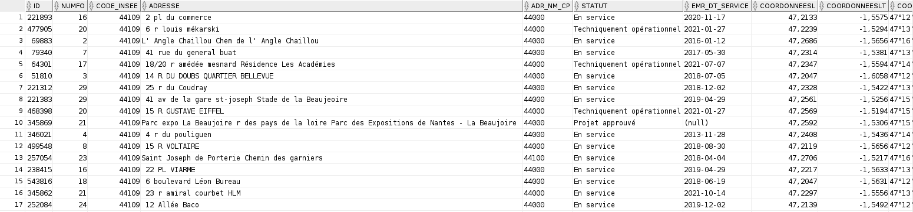
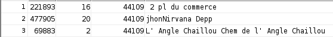
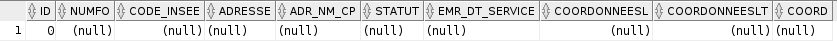
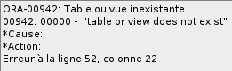

#  Compte Rendu du TP2 d'Exploitation d'une Base de Données

 Alexandre Clénet / Groupe 2  
* id : i2b07a
* Benjaminn Couet : i2b07b
* Nathan Marie : i2b06b
 
##  La base de données sur laquelle on travaille est : 

<span style="color: #e11d1d">DistributionLA</span> ((**ID**, #NUMFO, #CODE_INSEE, ADRESSE, STATUT, ...);       
<span style="color: #e69138">OperateurLA</span> (**NUMFO**, NOMFO, GENERATION, TECHNOLOGIE);   
<span style="color: #26B260">CommuneLA</span> (**CODE_INSEE**, NOMCOMMUNE, #NOMDEP);    

## Initialisation des tables :

### Création des `tables` par rapport à celles existantes :
```sql
create Table communeLA as select * from basetd.commune 
where nomdep='Loire-Atlantique';

create Table operateurLA as select * from basetd.operateur 
where generation in('4G','5G');

create Table distributionLA as select * from basetd.distribution 
where code_insee in(select code_insee from communela)
and numfo in (select numfo from operateurla);
``` 
### Création des `clés primaires` :
```sql
alter table communela add constraint pk_co primary key ( code_insee );
alter table distributionla add constraint pk_di primary key ( id );
alter table operateurla add constraint pk_op primary key ( numfo );
``` 
### Création des `clés étrangères` :
```sql
alter table distributionla
add constraint fk_di_co foreign key ( code_insee )
references communela ( code_insee );

alter table distributionla
add constraint fk_di_op foreign key ( numfo )
references operateurla ( numfo );
``` 

## Exercice 1 :

### 1. Donnez le droit de faire des Select sur vos tables à votre binôme.

```sql
Grant select on communeLA to i2b07b,i2b06b;
Grant select on operateurLA to i2b07b,i2b06b;
Grant select on distributionLA to i2b07b,i2b06b;
``` 
Résultat pour `Distribution` de la `Loire-Atlantique` : 

### 2. Donnez le droit de faire un Update du champ Adresse de la table Distribution.Vérifiez bien si la modification est bien faite.

```sql
Grant Update(adresse) on distributionLA to i2b07b,i2b06b;

update i2b06b.distributionsa set adresse='jonnhy depp' where id=288054;
update i2b07b.distributionve set adresse='jonnhy depp' where id=481650;
commit;
``` 

Résultat pour `Distribution` de la `Loire-Atlantique` : 

### 3. Donnez le droit de faire appel insert à la table Distribution. Vérifiez bien si l’insertion est bien faite.

```sql
Grant insert on distributionLA to i2b07b,i2b06b;

insert into i2b06b.distributionsa values (0,0,0,'testo',0,0,0,0,0,0); 
insert into i2b07b.distributionve values (0,0,0,'testo',0,0,0,0,0,0); 
commit;
``` 

Résultat pour `Distribution` de la `Loire-Atlantique` : 

### 4. Supprimez les différents droits que vous avez donné à la question 1,2 et 3. Votre binôme doit vérifier s’il a toujours accès à ces tables.

```sql
revoke select on communeLA from i2b07b,i2b06b;
revoke select on distributionLA from i2b07b,i2b06b;
revoke select on operateurLA from i2b07b,i2b06b;
revoke update on distributionLA from i2b07b,i2b06b;
revoke insert on distributionLA from i2b07b,i2b06b;
``` 

Résultat pour `Distribution` de la `Loire-Atlantique` : 

### 5. Votre table Distribution  contient les attributs  ADR_NM_CP, EMR_DT_SERVICE,COORDONNEESL, COORDONNEESLT, COORD.

```sql
create or replace view distributionLAbis as
select id,numfo,code_insee,adresse,statut from distributionLa;

--Permission
Grant select  on distributionLAbis to i2b07b,i2b06b;

--Test
select * from i2b07b.distributionVEbis;
select * from i2b06b.distributionSAbis;
``` 

### 6. Donnez le droit à votre binôme de voir le nombre d’antennes 4G et 5G des villes de votre département. Vous le faites via 2 vues différentes.

```sql
create or replace view LAville5g as
select distinct co.nom_commune,
(select count(*) from distributionla di, operateurla op
where op.numfo=di.numfo  and di.code_insee = co.code_insee
and op.generation='5G')count 
from communela co
order by 2 desc;

create or replace view LAville4g as
select distinct co.nom_commune,
(select count(*) from distributionla di, operateurla op
where op.numfo=di.numfo  and di.code_insee = co.code_insee
and op.generation='4G')count 
from communela co
order by 2 desc;

--Permission
Grant select  on LAville5g to i2b07b,i2b06b;
Grant select  on LAville4g to i2b07b,i2b06b;

--Test
select * from i2b07b.VEville5g;
select * from i2b07b.VEville4g;
select * from i2b06b.SAville5g;
select * from i2b06b.SAville4g;
``` 

### 7. Donnez le droit à votre binôme de voir le nombre d’antennes 4G et 5G de chaque opérateur pour les différentes Villes. 

```sql
create or replace view LAville5gOp as
select distinct co.nom_commune,op.nomfo,count(*)count5g
from communela co,operateurla op,distributionla di
where op.numfo=di.numfo  and di.code_insee = co.code_insee
and op.generation='5G'
group by co.nom_commune,op.nomfo
order by 3 desc;

create or replace view LAville4gOp as
select distinct co.nom_commune,op.nomfo,count(*)count4g
from communela co,operateurla op,distributionla di
where op.numfo=di.numfo  and di.code_insee = co.code_insee
and op.generation='4G'
group by co.nom_commune,op.nomfo
order by 3 desc;

--Permission
Grant select  on LAville5gOp to i2b07b,i2b06b;
Grant select  on LAville4gOp to i2b07b,i2b06b;

--Test
select * from i2b07b.VEville5gOp;
select * from i2b07b.VEville4gOp;
select * from i2b06b.SAville5gOp;
select * from i2b06b.SAville4gOp;
``` 

### 8. idem que la question précédente avec la répartition des différentes technologies.

```sql
create or replace view LAville5gOpTech as
select distinct co.nom_commune,op.nomfo,op.technologie,count(*)count5g
from communela co,operateurla op,distributionla di
where op.numfo=di.numfo  and di.code_insee = co.code_insee
and op.generation='5G'
group by co.nom_commune,op.nomfo,op.technologie
order by 4 desc;

create or replace view LAville4gOpTech as
select distinct co.nom_commune,op.nomfo,op.technologie,count(*)count4g
from communela co,operateurla op,distributionla di
where op.numfo=di.numfo  and di.code_insee = co.code_insee
and op.generation='4G'
group by co.nom_commune,op.nomfo,op.technologie
order by 4 desc;

--Permission
Grant select  on LAville5gOpTech to i2b07b,i2b06b;
Grant select  on LAville4gOpTech to i2b07b,i2b06b;

--Test
select * from i2b07b.VEville5gOpTech;
select * from i2b07b.VEville4gOpTech;
select * from i2b06b.SAville5gOpTech;
select * from i2b06b.SAville4gOpTech;
``` 
### 9. idem à la question 7, mais vous donnez que les 20 meilleurs Villes avec la 5G en rajouter la colonne du nombre d’antennes de la  4G, de l’opérateur ORANGE.

```sql
create or replace VIEW LAvilleOpOrange as 
select * from LAville5gOP NATURAL JOIN LAville4gOP
where nomfo = 'ORANGE'
order by 3 desc
fetch next 20 rows only;

--Test
select * from i2b07b.VEvilleOpOrange;
select * from i2b06b.SAvilleOpOrange;
``` 
## Exercice 2 :

### 1. Créez un rôle Mon_Ami.

```sql
create role Mon_Ami_Hell;
grant Mon_Ami_Hell to i2b07b,i2b06b;
``` 

### 2. Affectez à ce rôle les privilèges correspondant aux questions 1,2 et 3.

```sql
Grant select on communeLA to Mon_Ami_Hell;
Grant select on operateurLA to Mon_Ami_Hell;
Grant select on distributionLA to Mon_Ami_Hell;
Grant Update(adresse) on distributionLA to Mon_Ami_Hell;
Grant insert on distributionLA to Mon_Ami_Hell;
``` 
### 3. Activez et Affectez ce rôle à votre binôme. Après activation du rôle, votre binôme doit faire les tests  sur les différentes tables.

```sql
update i2b06b.distributionsa set adresse='jonnhy depp2' where id=288054;
update i2b07b.distributionve set adresse='jonnhy depp2' where id=481650;
select * from i2b07b.distributionve;
select * from i2b06b.distributionsa;
``` 
### 4. Supprimer le privilège des select des différentes tables au rôle loginMon_Ami. 

```sql
revoke select on communeLA from Mon_Ami_Hell;
revoke select on distributionLA from Mon_Ami_Hell;
revoke select on operateurLA from Mon_Ami_Hell;
``` 
### 5. Supprimer le rôle LoginMon_Ami à votre binôme.

```sql
revoke Mon_Ami_HellVOIRTABLE from i2b07b,i2b06b;
``` 
### 6. Créez un rôle LoginVoir_mes_tables qui contient les privilèges de la question1 et un autre rôle LoginMAJ_mes_tables avec les privilège de la question 2 et 3.

```sql
create role Mon_Ami_HellVOIRTABLE;
create role Mon_Ami_HellMAJ;

Grant select on communeLA to Mon_Ami_HellVOIRTABLE;
Grant select on operateurLA to Mon_Ami_HellVOIRTABLE;
Grant select on distributionLA to Mon_Ami_HellVOIRTABLE;
Grant Update(adresse) on distributionLA to Mon_Ami_HellMAJ;
Grant insert on distributionLA to Mon_Ami_HellMAJ;
``` 
### 7. Créez un rôle LoginVoir_Update qui regroupe les rôles de la question précédente.

```sql
create role Mon_Ami_HellVOIRMAJ;

grant Mon_Ami_HellVOIRTABLE,Mon_Ami_HellMAJ to Mon_Ami_HellVOIRMAJ;
``` 
### 8. Affectez ce rôle à votre binôme et testez les différentes actions.

```sql
grant Mon_Ami_HellVOIRMAJ to i2b07b,i2b06b;

select * from i2b07b.distributionve;
select * from i2b06b.distributionsa;
``` 
### 9. Supprimer le rôle LoginUpdate_mes_tables au rôle LoginVoir_Update et vérifiez les différents actions.

```sql
revoke Mon_Ami_HellMAJ from Mon_Ami_HellVOIRMAJ;
select * from i2b07b.distributionve;
select * from i2b06b.distributionsa;
update i2b06b.distributionsa set adresse='jonnhy depp' where id=288054;
update i2b07b.distributionve set adresse='jonnhy depp' where id=481650;
``` 

## Exercice 3 :

### 1. L’utilisateur 1 :Créez les tables à partir de basetd qui contient des villes de Loire-Atlantique avec la 4G ou la 5G. 

Pas beaucoup de `changements` par rapport aux premières pour `Loire-Atlantique` 
```sql
create Table communeLA as select * from basetd.commune 
where nomdep='Loire-Atlantique';

create Table operateurLA as select * from basetd.operateur 
where generation in('4G','5G');

create Table distributionLA as select * from basetd.distribution 
where code_insee in(select code_insee from communela)
and numfo in (select numfo from operateurla);
``` 
### 2. L’utilisateur2:Créez les tables(CommuneVE, DistributionVE) à partir de basetd et de la table OperateurLA de l’utilisateur1 qui contient les  villes de Vendée avec la 4G et la 5G. Quel droit devriez-vous recevoir pour la table  DistributionVE.

```sql
--Permission
grant select on operateurLA to i2b07b,i2b06b;
``` 
### 3. Vous devez maintenant créer les contraintes d’intégrité PK et FK des tables en locale.
`Loire-Atlantique :`
```sql
--Clé Primaires
alter table communela add constraint pk_co primary key ( code_insee );
alter table distributionla add constraint pk_di primary key ( id );
alter table operateurla add constraint pk_op primary key ( numfo );

--Clé Étrangères
alter table distributionla
add constraint ce_distribution_commune foreign key ( code_insee )
references communela ( code_insee );

alter table distributionla
add constraint ce_distribution_operateur foreign key ( numfo )
references operateurla ( numfo );
``` 
`Vendée :`
```sql
--Clé Primaires
alter table communeve add constraint pk_co primary key ( code_insee );
alter table distributionve add constraint pk_di primary key ( id );
--Clé étrangères
alter table distributionve
add constraint ce_distribution_commune foreign key ( code_insee )
references communeve ( code_insee );
``` 
### 4. Créez maintenant les contraintes qui sont distants. Quel droit l’utilisateur1 doit donner à l’utilisateur2 pour qu’il puisse créer la clé étrangère de la table DistributionVE vers la table OperateurLA.

La `permission` pour accéder à `OperateurLA` :
```sql
grant references on operateurLA to i2b07b,i2b06b;
``` 
Commande pour la `Vendée` :
```sql
alter table distributionve
add constraint ce_distribution_operateur foreign key ( numfo )
references i2b07a.operateurla ( numfo );
``` 
### 5. Refaire les mêmes questions(6, 7 et 8 de l’exercice1) avec la gestion des droits. En plus des select sur les tables, vous lui donnez aussi le droit des voir les différentes vues créées sur votre compte.

```sql
grant select on operateurLA to i2b07b,i2b06b with grant option;
```
Vu que pour la `Loire-Atlantique` les requêtes sont identiques, on regarde pour la `Vendée`.
 
```sql
create or replace view VEville5g as
select distinct c.nom_commune ,
(select count(*) from distributionve d, i2b07a.operateurla o 
where o.numfo=d.numfo and o.generation='5G' and c.code_insee=d.code_insee)count
from communeve c
order by 2 desc;

create or replace view VEville4g as
select distinct c.nom_commune ,
(select count(*) from distributionve d, i2b07a.operateurla o 
where o.numfo=d.numfo and o.generation='4G' and c.code_insee=d.code_insee)count
from communeve c
order by 2 desc;

select * from veville4g;

grant select on veville5g to i2b07a,i2b06b;

grant select on veville4g to i2b07a,i2b06b;


create or replace view VEville5gOp as
select distinct co.nom_commune,op.nomfo,count(*)count5G
from communeve co,i2b07a.operateurla op,distributionve di
where op.numfo=di.numfo and di.code_insee = co.code_insee
and op.generation='5G'
group by co.nom_commune,op.nomfo
order by 3 desc;

create or replace view veville4gOp as
select distinct co.nom_commune,op.nomfo,count(*)count4G
from communeve co,i2b07a.operateurla op,distributionve di
where op.numfo=di.numfo and di.code_insee = co.code_insee
and op.generation='4G'
group by co.nom_commune,op.nomfo
order by 3 desc;
--Permission
Grant select on VEville5gOp to i2b07a,i2b06b;
Grant select on VEville4gOp to i2b07a,i2b06b;


create or replace view VEville5gOpTech as
select distinct co.nom_commune,op.nomfo,op.technologie,count(*)count5G
from communeve co,i2b07a.operateurla op,distributionve di
where op.numfo=di.numfo and di.code_insee = co.code_insee
and op.generation='5G'
group by co.nom_commune,op.nomfo,op.technologie
order by 4 desc;


create or replace view veville4gOpTech as
select distinct co.nom_commune,op.nomfo,op.technologie,count(*)count4G
from communeve co,i2b07a.operateurla op,distributionve di
where op.numfo=di.numfo and di.code_insee = co.code_insee
and op.generation='4G'
group by co.nom_commune,op.nomfo,op.technologie
order by 4 desc;
--Permission
Grant select on veville5gOpTech to i2b07a,i2b06b;
Grant select on veville4gOpTech to i2b07a,i2b06b;
``` 


