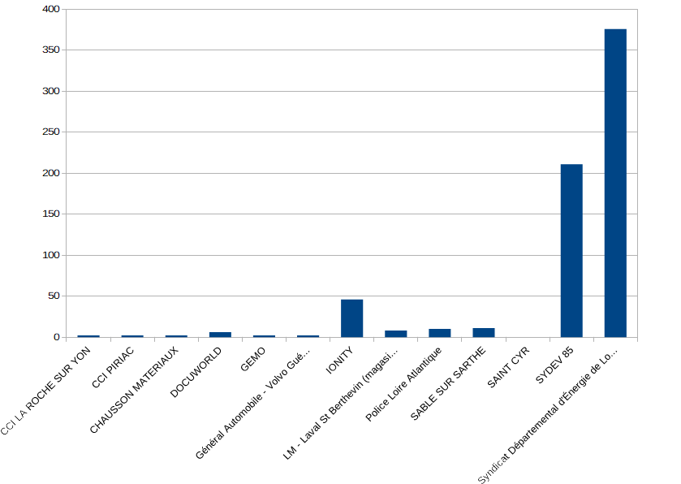
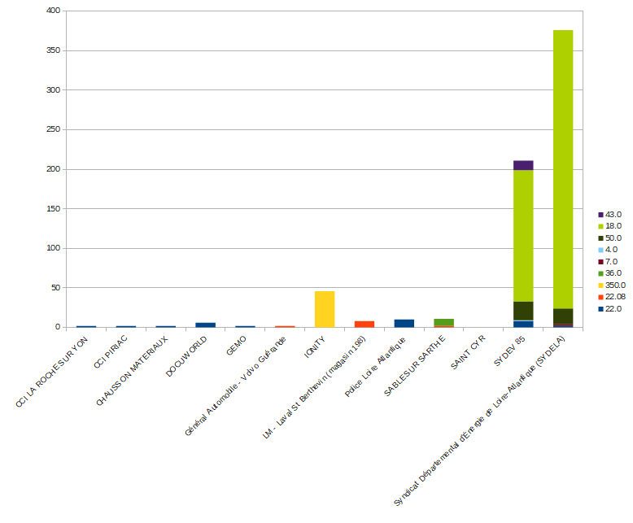
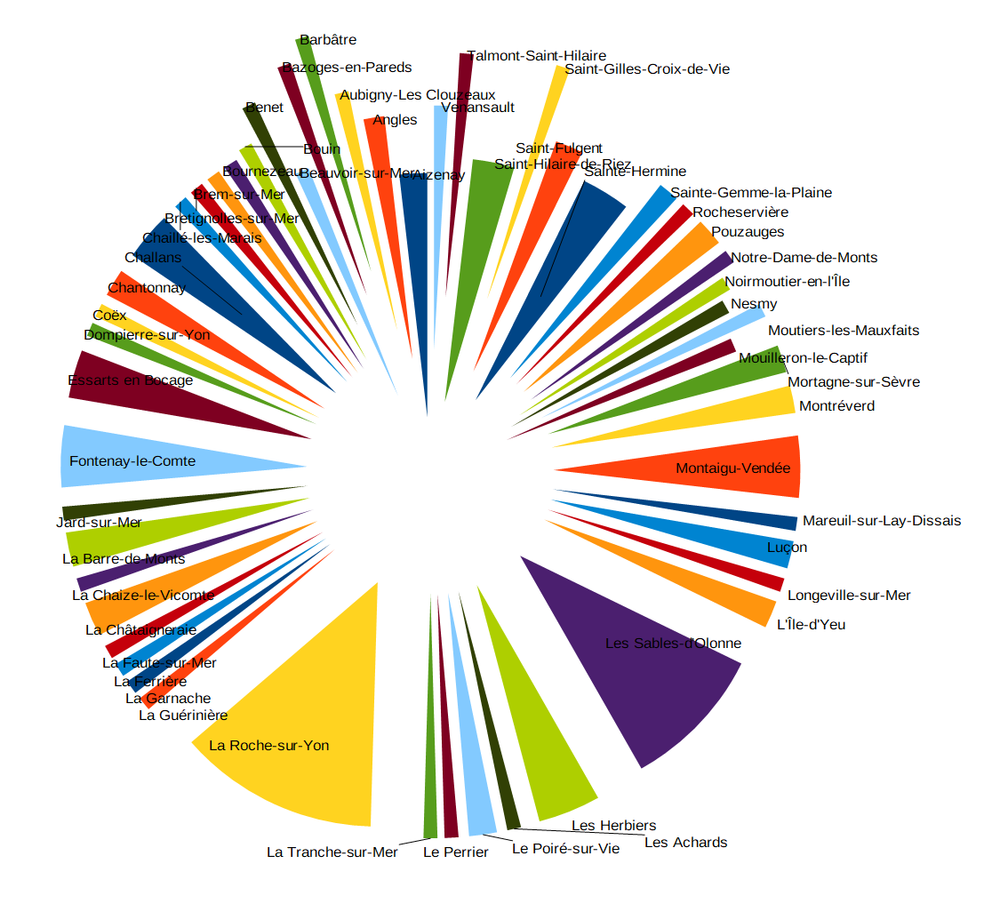
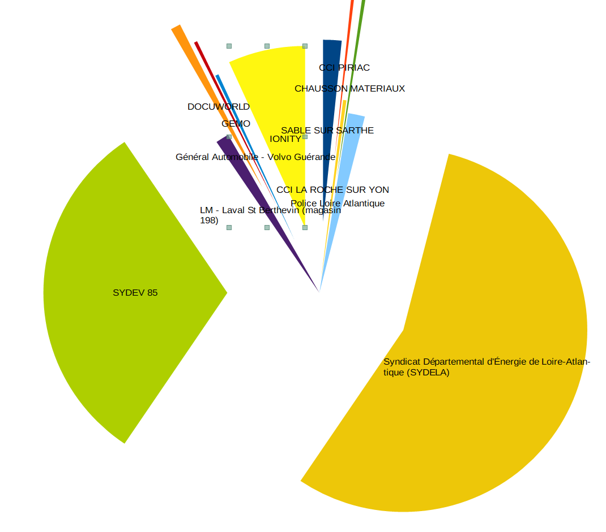
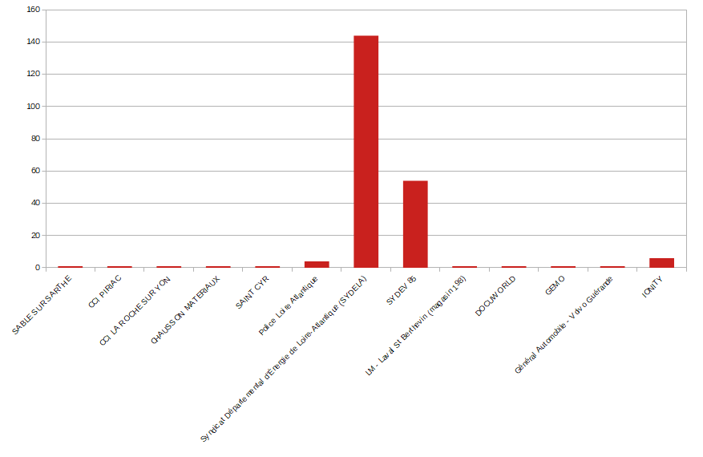

#  Compte Rendu du Mini-Projet / Exploitation d'une Base de Données

 Alexandre Clénet - Benjamin Couet - Nathan Marie - Romain Gouraud / Groupe 2  
* Alexandre Clénet : i2b07a
* Benjamin Couet : i2b07b
* Nathan Marie : i2b06b
* Romain Gouraud : i2b05b
 
##  La base de données donné en première forme normale :

RECHARGEELECTRIQUE ( codestation, nombrepointsdecharge, aménageur, enseigne, opérateur, libelléstation, adresse, longitude, latitude, codepointdecharge, puissancemaximum, typedeprise, accèsrecharge, horaires, observations, datedemiseajour, localisation, insee, commune, département, code_dep, code_reg ); 

## 1. Décomposer cette table en plusieurs tables. Chaque relation doit-être en 3ième forme normale.
<span style="color: #e11d1d">Station</span> ((<span style="color: #e11d1d">**codestation**</span>, nombrepointsdecharge, aménageur, enseigne, opérateur, libelléstation, adresse, longitude, latitude, <span style="color: #26B260">#insee</span>, source, <span style="color: #e69138">#codepointdecharge</span> );       
<span style="color: #e69138">Borne</span> (<span style="color: #e69138">**codepointdecharge**</span>, puissancemaximum, typedeprise, accèsrecharge, horaires, observations, datedemiseajour, localisation );   
<span style="color: #26B260">Commune</span> (<span style="color: #26B260">**insee**</span>, commune, <span style="color: #4155ff">#département</span> );   
<span style="color: #4155ff">Département</span> (<span style="color: #4155ff">**département**</span>, code_dep, code_reg );

## 2.	Répartissez les tables sur chaque étudiant. Attention les données doivent être partagées. Chaque étudiant doit travailler sur ces propre données.

### Alexandre : `Station`
```sql
create Table Station as select 
    codestation,
    nombrepointsdecharge,
    aménageur,
    enseigne,
    opérateur,
    libelléstation,
    adresse,
    longitude,
    latitude,
    insee,
    source,
    codepointdecharge
from basetd.rechargeelectrique;
--Transformation en nombre
update station
set nombrepointsdecharge=Replace(nombrepointsdecharge, '.', ',');
--Maj des données
DELETE FROM station WHERE insee='85234.0';
DELETE FROM station WHERE insee='44143.0';
DELETE FROM station WHERE insee='85234.0';
insert into i2B05B.commune VALUES('85234.0','Saint-Jean-de-Monts','Vendée');
insert into i2B05B.commune VALUES('44143','Rezé','Loire-Atlantique');
update i2B05B.commune set insee = '44143.0' where insee ='44143' ;
update station set insee = '85234.0' where CODESTATION ='FR*S85*P85234*001' ;
```
### Nathan : `Borne`
```sql
create table borne as select
    codepointdecharge,
    puissancemaximum,
    typedeprise,
    accèsrecharge,
    horaires,
    observations,
    datedemiseajour,
    localisation   
from basetd.rechargeelectrique;
```
### Romain : `Commune`
```sql
create table commune as select distinct 
    insee, 
    commune, 
    département 
from BASETD.rechargeelectrique ;
--Repérage de doublons
SELECT  insee,COUNT(*) AS insee
FROM     commune
GROUP BY insee
HAVING   COUNT(*) > 1;
--Suppression
delete from commune where commune = 'Saint-Paul';
delete from commune where département = 'Ille-et-Vilaine';
delete from commune where département = 'Gironde';
--Modification
update commune set insee = '85248.0' where commune ='Saint-Martin-Lars-en-Sainte-Hermine' ;
delete from commune where insee='85248.0';
commit;
```
### Benjamin : `Département`
```sql
create table Departement as select distinct 
    département,
    code_dep, 
    code_reg 
from basetd.rechargeelectrique where département not in 
    --On enlève les Département hors Pays de la Loire :
    (select département from basetd.rechargeelectrique where département in
        ('Gironde', 'La Réunion' ,'Ille-et-Vilaine') );

```
## 3. Vous devez maintenant créer les contraintes d’intégrité PK et FK des tables en locale.

### Alexandre : `Station`
```sql
ALTER TABLE station ADD CONSTRAINT pk_station PRIMARY KEY ( codestation );
```
### Nathan : `Borne`
```sql
ALTER TABLE borne ADD CONSTRAINT pk_borne PRIMARY KEY ( codepointdecharge );
```
### Romain : `Commune`
```sql
ALTER TABLE commune ADD CONSTRAINT pk_commune PRIMARY KEY ( insee );
```
### Benjamin : `Département`
```sql
ALTER TABLE Departement ADD CONSTRAINT pk_departement PRIMARY KEY (département);
```
## 4. Créez maintenant les contraintes qui sont distants.  Donnez les différents droits qui sont utilisés.

### Alexandre : `Station`
```sql
--Droits
grant select on station to i2b06b, i2b07b, i2b05b;
grant update on station to i2b06b, i2b07b, i2b05b;
grant insert on station to i2b06b, i2b07b, i2b05b;

--Clé étrangère
alter table station add constraint fk_insee_station 
foreign key(insee) references i2b05b.commune(insee);

--Clé étrangère
alter table station add constraint fk_codepointdecharge_station 
foreign key(codepointdecharge) references i2b06b.borne(codepointdecharge);
```
### Nathan : `Borne`
```sql
--Droits
grant select on borne to i2b07b, i2b07a, i2b05b;
grant update on borne to i2b07b, i2b07a, i2b05b;
grant insert on borne to i2b07b, i2b07a, i2b05b;
grant REFERENCES (codepointdecharge) on borne to i2b07a;

```
### Romain : `Commune`
```sql
--Droits
grant select on commune to i2b06b, i2b07a, i2b07b;
grant update on commune to i2b06b, i2b07a, i2b07b;
grant insert on commune to i2b06b, i2b07a, i2b07b;
grant REFERENCES (insee) on commune to i2b07a;

--Clé étrangère
alter table commune add constraint fk_commune foreign key(département) references i2b07b.Departement(département);
```
### Benjamin : `Département`
```sql
--Droits
grant select on departement to i2b06b, i2b07a, i2b05b;
grant update on departement to i2b06b, i2b07a, i2b05b;
grant insert on departement to i2b06b, i2b07a, i2b05b;
grant REFERENCES (département) on departement to i2b05b;

```
## 5. Donnez les requêtes suivantes :
On va se focaliser sur `un seul identifiant` car les requetes sont les memes pour tout le monde. (La seule différence est la table propre à l'id, ici présent `point de vue` de `Station / Alexandre`) 

###	Affichez pour chaque Aménageur le nombre de prises par commune. Dans ce cas avoir une requête par département. En sortie : Aménageur, commune , nombre de prises.
```sql
--Loire-Atlantique :
select aménageur,commune,sum(nombrepointsdecharge) nbrprise
from I2B05B.commune natural join I2B07B.departement natural join station
where département='Loire-Atlantique'
group by aménageur,commune
order by 1;
--Vendée :
select aménageur,commune,sum(nombrepointsdecharge) nbrprise
from I2B05B.commune natural join I2B07B.departement natural join station
where département='Vendée'
group by aménageur,commune
order by 1;
--Sarthe :
select aménageur,commune,sum(nombrepointsdecharge) nbrprise
from I2B05B.commune natural join I2B07B.departement natural join station
where département='Sarthe'
group by aménageur,commune
order by 1;
--Mayenne :
select aménageur,commune,sum(nombrepointsdecharge) nbrprise
from I2B05B.commune natural join I2B07B.departement natural join station
where département='Mayenne'
group by aménageur,commune
order by 1;
--Maine-et-Loire :
select aménageur,commune,sum(nombrepointsdecharge) nbrprise
from I2B05B.commune natural join I2B07B.departement natural join station
where département='Maine-et-Loire'
group by aménageur,commune
order by 1;
```
###	Afficher pour chaque Aménageur le nombre de prises avec la puissance Max
```sql
select aménageur,puissancemaximum,sum(nombrepointsdecharge) nbrprise
from I2B06B.borne natural join station
group by aménageur,puissancemaximum
order by 1;
```
###	Affichez pour chaque département la répartition des prises par commune. Dans ce cas avoir une requête par département. En sortie : Commune , nombre de prises.
```sql
--Loire-Atlantique :
select commune,sum(nombrepointsdecharge) nbrprise
from I2B05B.commune natural join I2B07B.departement natural join station
where département='Loire-Atlantique'
group by commune
order by 1;
--Vendée :
select commune,sum(nombrepointsdecharge) nbrprise
from I2B05B.commune natural join I2B07B.departement natural join station
where département='Vendée'
group by commune
order by 1;
--Sarthe :
select commune,sum(nombrepointsdecharge) nbrprise
from I2B05B.commune natural join I2B07B.departement natural join station
where département='Sarthe'
group by commune
order by 1;
--Mayenne :
select commune,sum(nombrepointsdecharge) nbrprise
from I2B05B.commune natural join I2B07B.departement natural join station
where département='Mayenne'
group by commune
order by 1;
--Maine-et-Loire :
select commune,sum(nombrepointsdecharge) nbrprise
from I2B05B.commune natural join I2B07B.departement natural join station
where département='Maine-et-Loire'
group by commune
order by 1;

```
###	Proposez 2 autres types de requêtes
```sql
--Nombre de prises total par aménageurs
select aménageur,sum(nombrepointsdecharge) nbrprise
from I2B06B.borne natural join station
group by aménageur
order by 1;

--Aménageurs qui possèdent des bornes gratuites
select distinct aménageur
from I2B06B.borne natural join station
where accèsrecharge in ('Gratuit','gratuit')
order by 1;
```

## 6. Vous générez  aussi différents graphiques(en batons et  batons empilés).
### `Nombre de prises` pour chaque `aménageur` :

### `Nombre de prises` pour chaque `aménageur` avec chaque puissance :

### `Nombre de prises` pour chaque `commune vendéenne` :

## 7. Faites une synthèse de ces requêtes en passant par des vues. C’est à dire avoir une vue globale des Pays de la Loire. Quels droits devriez vous lui donner.
```sql
create or replace view nbrpriseAménLA as
select aménageur,commune,sum(nombrepointsdecharge) nbrprise
from I2B05B.commune natural join I2B07B.departement natural join station
where département='Loire-Atlantique'
group by aménageur,commune
order by 1;

create or replace view nbrpriseAménVE as
select aménageur,commune,sum(nombrepointsdecharge) nbrprise
from I2B05B.commune natural join I2B07B.departement natural join station
where département='Vendée'
group by aménageur,commune
order by 1;

create or replace view nbrpriseAménSA as
select aménageur,commune,sum(nombrepointsdecharge) nbrprise
from I2B05B.commune natural join I2B07B.departement natural join station
where département='Sarthe'
group by aménageur,commune
order by 1;

create or replace view nbrpriseAménMA as
select aménageur,commune,sum(nombrepointsdecharge) nbrprise
from I2B05B.commune natural join I2B07B.departement natural join station
where département='Mayenne'
group by aménageur,commune
order by 1;

create or replace view nbrpriseAménML as
select aménageur,commune,sum(nombrepointsdecharge) nbrprise
from I2B05B.commune natural join I2B07B.departement natural join station
where département='Maine-et-Loire'
group by aménageur,commune
order by 1;

create or replace view nbrpriseAménPDL as
select * from nbrpriseAménLA
union all
select * from nbrpriseAménVE
union all
select * from nbrpriseAménSA
union all
select * from nbrpriseAménMA
union all
select * from nbrpriseAménML;
```
## 8. A partir de ces Vues, vous donnez les différents graphiques.
### `Nombre de prises` pour chaque `aménageur` des `Pays de la Loire` :
requête : select aménageur,sum(nbrprise) from nbrpriseAménPDL group by aménageur;


### `Nombre de communes` prisent en charge par chaque `aménageur` :
requête : select aménageur,count(*) from nbrpriseAménPDL group by aménageur;
