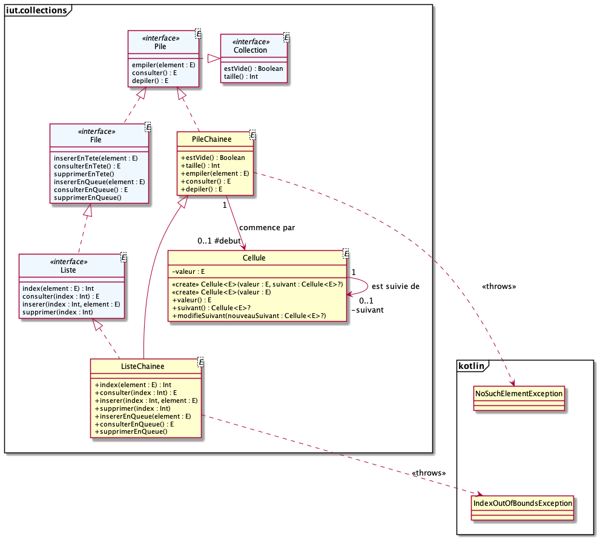

# dev.objets.tp10

Considerez le diagramme de classes suivant :

= version plus complete du diagramme de classe du TD9.

1. Implémentez la classe `PileChainee` qui construit une pile en utilisant
un chainage d'objets `Cellule`
2. Implémentez la classe `ListeChainee` héritant de `PileChainee`
qui construit une liste et une file en utilisant un chainage 
d'objets `Cellule`

Des cas de tests vous permettent de vérifier votre implémentation.
Renommez les fichiers `.ktest` en `.kt` pour tester l'usage de vos classes.

