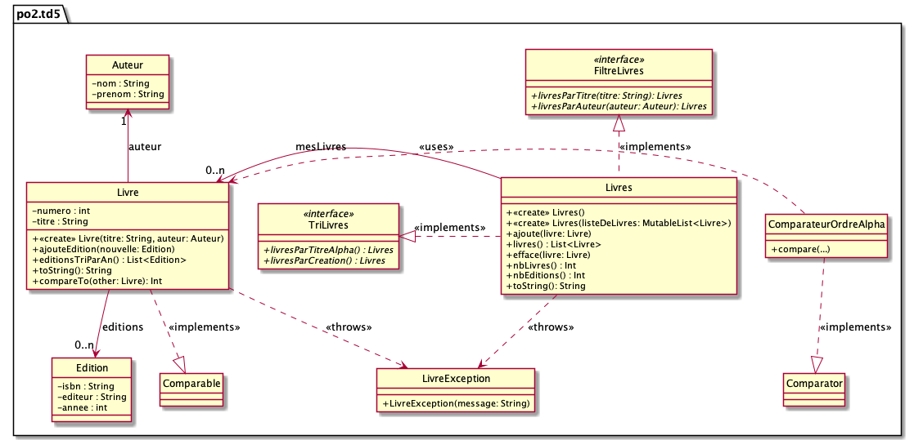

# dev.objets.tp12

L’objectif de ce TP consiste à implémenter un modèle de données métiers correspondant
à des livres ; plus précisément, il s’agira d’implémenter un ensemble de classes et de
méthodes permettant de gérer un catalogue de livres

Considérez le diagramme de classes suivant :

À partir du diagramme de classes et des squelettes de code fournis, vous implémenterez toutes les fonctionnalités attendues.
Vous ne modifierez pas les noms des classes, des méthodes, la signature des méthodes, etc.
Vous pouvez, par contre, faire des ajouts si nécessaire (méthodes, en particulier).

Règle de validation de l'ISBN : https://www.instructables.com/How-to-verify-a-ISBN/

NB : dans le cas d'un ISBN-10, le dernier chiffre peut être remplacé par la lettre "X", 
qui représente le nombre "10".