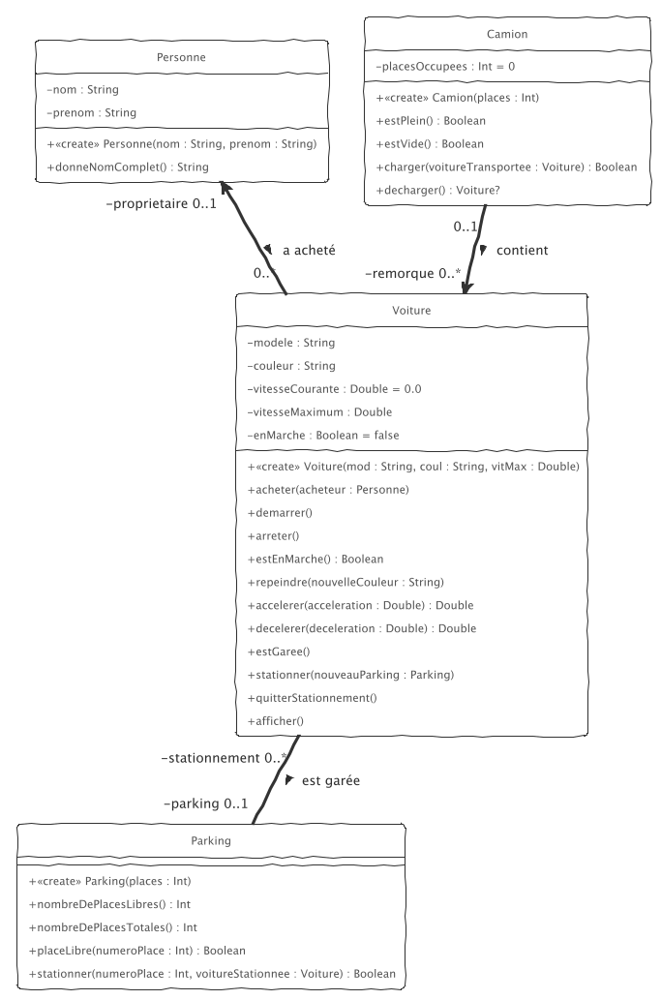

# TP3

Il va s'agir d'implémenter le diagramme de classes UML suivant :

pour compiler, simplement `ant buid`.

Attention à bien respecter __SCRUPULEUSEMENT__ le nom des classes, des méthodes, des paramètres, etc. Sinon, les tests ne compileront pas. 

Dans `test/` vous avez des cas de tests validant le fonctionnement de votre code : pour les exécuter, renommez, au fur et à mesure, l'extension du fichier de test `.ktest` en `.kt`, puis simplement `ant test` (comme vous n'avez pas tout codé, si tous les fichiers de tests étaient considérés dès le départ, vous auriez trop d'erreur de compilation)

1. Implémentez la classe `Personne`

La méthode `donneNomComplet()` retourne le prénom suivi d'un espace, suivi du nom en majuscule.

2. Implémentez la classe `Voiture` sans tenir compte du parking ni des méthodes corrrespondant au stationnement.

Les méthodes de la classe `Voiture` sont documentées comme suit :

- `acheter(acheteur : Personne)` -- Indique qu'une personne a acheté la voiture
- `demarrer()` -- Démarre la voiture
- `arreter()` -- Arrête la voiture ; passe instantanément la vitesse à 0.0
- `estEnMarche() : Boolean` -- Renvoie `true` si la voiture est en marche, `false` dans le cas contraire
- `repeindre(nouvelleCouleur : String)` -- Repeint la voiture avec la nouvelle couleur, seulement si la voiture est arrêtée
- `accelerer(acceleration : Double) : Double` -- Accélère la voiture si celle-ci est en marche, sans dépasser la vitesse maximum et renvoie la nouvelle vitesse de la voiture
- `decelerer(deceleration : Double) : Double` -- Ralentit la voiture si celle-ci est en marche, et renvoie la nouvelle vitesse de la voiture
- `afficher()` -- affiche toutes les informations concernant la voiture ; Exemple

        Voiture Batmobile Tumbler de couleur noire est à l'arrêt
        Voiture Batmobile Tumbler de couleur noire, propriété de Bruce WAYNE, est à l'arrêt
        Voiture Batmobile Tumbler de couleur noire, propriété de Bruce WAYNE, roule à 147.8 / 257.0

3. Implémentez la classe `Parking` : les places sont numérotées à partir de 0 ; on utilisera un `Array<Voiture?>` pour stocker les voitures à stationner dans le parking. 

La méthode `stationner(numeroPlace : Int, voitureStationnee : Voiture) : Boolean` gare la voiture, si la place est libre et si la voiture n'est pas déjà garée ; elle retourne `true` si le stationnement a été réalisé.

4. Prenez maintenant en compte du parking dans `Voiture` : 

- `estGaree()` -- Indique si la voiture est garée
- `stationner(nouveauParking : Parking)` -- Stationne la voiture sur le parking indiqué ; doit arrêter la voiture
- `quitterStationnement()` -- Indique que la voiture a quitté le stationnement ; doit démarrer la voiture

5. Implémentez la classe `Camion`:  le camion fonctionne comme une sorte de pile ; on charge et on les décharge les voitures dans l'ordre "premier chargé, dernier déchargé" ; pour implémenter la remorque (cardinalité `0..*`), on choisira encore un `Array<Voiture?>`.
Pour charger une voiture, il faudra qu'il y ait de la place, que la voiture ne soit pas déjà chargée et que la voiture soit à l'arrêt.
