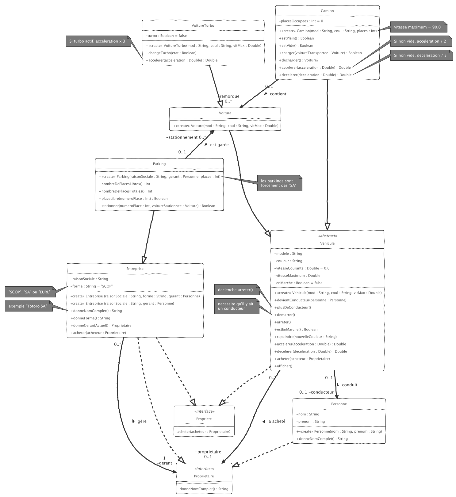

# TP4 (suite du TP3)

__Le projet du TP3 a évolué. Voici le nouveau diagramme de classes à implémenter.__

A vous de jouer !!!! 

Des cas de tests dans `test/` vous permettent de valider votre développement (Pensez à renommer les fichiers `.ktest -> .kt`)

Mais avant cela, lisez les détails donnés plus bas...

Récupérez le code du TP3 que vous modifierez.

__ATTENTION à éviter au maximum de dupliquer du code !!!__

`Voiture` et `Camion` sont maintenant des `Vehicule`s. 
La classe abstraite `Vehicule` se comporte presque comme la `Voiture` du TP3.
Un vehicule peut avoir un `conducteur` qui est une `Personne`. 

Un `Camion` contient toujours des voitures (version TP3), mais on peut donc démarrer, accelerer, etc. un camion également. 

Un vehicule a toujours un `proprietaire`, mais maintenant celui-ci peut être une `Personne` ou bien une `Entreprise`. On peut acheter un vehicule, cad modifier le proprietaire.

NB : une voiture ne s'occupe plus de savoir où elle est garée.

Il est existe des voitures "spéciales" équipées d'un turbo.

Une `Entreprise` a aussi un proprietaire, son `gerant` : elle peut être achetée par une `Personne` ou bien une `Entreprise` mais à la création d'une entreprise, le gérant est forcément une `Personne`. 

Un `Parking` est une sorte d'`Entreprise` sur laquelle sont garées des voitures (comme dans le TP3).

