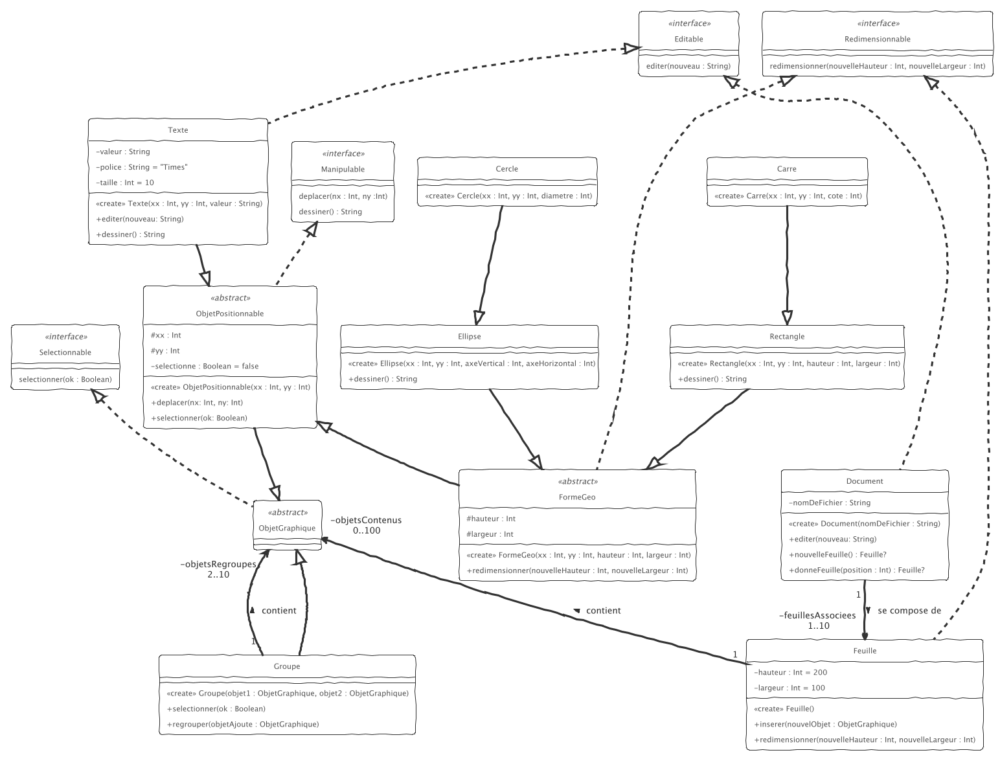

# dev.objets.tp5

_TP5 à réaliser sous IntelliJ._

Commencez par cloner ce dépôt dans IntelliJ, puis implémenter le diagramme de classes suivant.

__Conseil :__ commencez par implémenter la hiérarchie d'héritage `ObjetGraphique` < `ObjetPositionnable` 
< `FormeGeo`... puis ajouter `Groupe` ; terminez par `Document` et `Feuille`

Comme précédemment, activez les cas de tests au fure-et-à-mesure
en renommant les fichiers `.ktest` en `.kt` ("Clic droit" `> Refactor > Rename`)

Quelques précisions :
- Un `Document` contient toujours au moins une `Feuille`, et jusqu'à 10 feuilles maximum
- `Document.NouvelleFeuille()` ajoute une feuille dans le document
- `Document.editer(nouveau)` modifie le nom de fichier du Document
- Un `Groupe` regoupe à minima 2 objets graphiques
- `Groupe.selectionner(ok)` (de)selectionne tous les objets du groupe
- `dessiner()` donneune chaine représentant toutes les caractéristiques
de l'objet graphique considéré, comme suit :
  
  
    Texte(4,2,"totoro") => "totoro":X=4,Y=2,P=Times,S=10
    Rectangle(4,2,420,42) => [X=4,Y=2,H=420,L=42]
    Carre(4,2,42) => [X=4,Y=2,H=42,L=42]
    Ellipse(4,2,420,42) => (X=4,Y=2,AV=420,AH=42)
    Cercle(4,2,42) => (X=4,Y=2,AV=42,AH=42)

- 