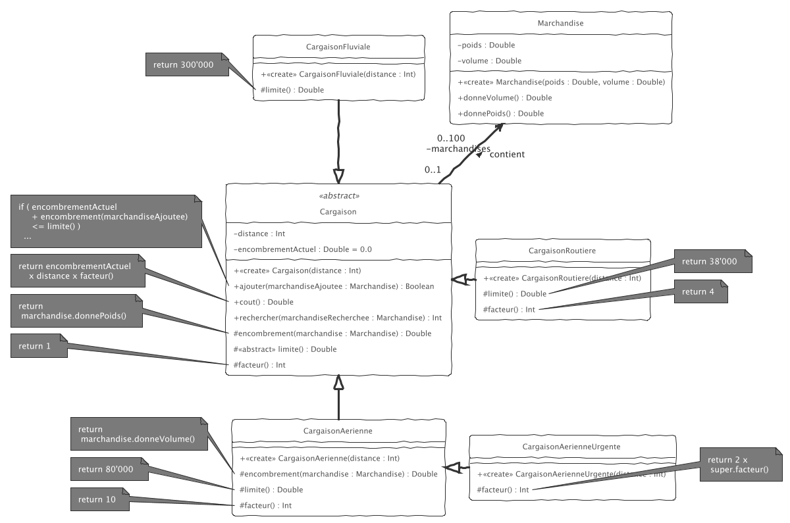

# dev.objets.tp6

_TP6 à réaliser sous IntelliJ._

Commencez par cloner ce dépôt dans IntelliJ, 

1. implémentez le diagramme de classes suivant.
2. donnez des cas de tests pour valider les Cargaions fluviales, aeriennes et aeriennes urgentes

