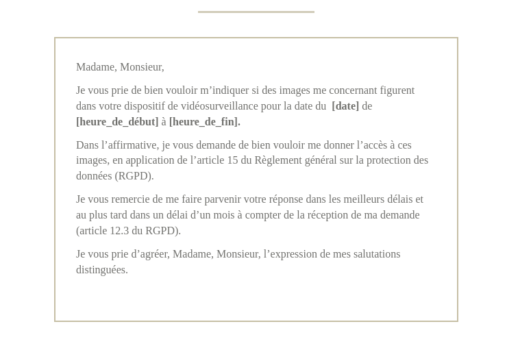
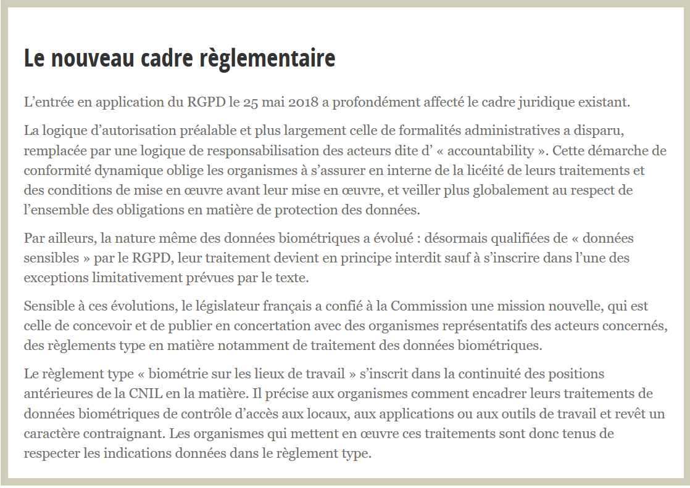

# TD1 : La loi « informatique et libertés » et introduction au RGPD

Alexandre Clenet / Groupe 2

## 1 – Rappelez la composition et les 4 principales missions de la `CNIL`

La CNIL est composée d'un collège pluridisciplinaire de 18 membres dont 12 sont élus ou désignés et d'une équipe de 225 agents contractuels.

La CNIL a 4 missions pour accompagner les particuliers et professionnels à proteger leurs données et excercer leurs droits :
- Mission 1 - Informer, protéger les droits : La première mission et pas la moindre est d'informer le grand public et les professionels. Elle organise des campagnes de renseignements et diverses conférences afin de sensibliser de manière pédagogique sur les différents droits du numérique notamment au RGPD (règlement général sur la protection des données). La CNIL veille aussi à ce que chaque citoyens accèdent à ses données et en cas de difficulté, qu'ils puissent formuler des plaintes.
- Mission 2 - Accompagner la conformité / conseiller : Afin d'accompagner les organismes, la CNIL propose une boîte à outils complète et adaptée en fonction de leur taille et de leurs besoins. Pour offrir une meilleure protection des données personnelles, la CNIL travaille activement avec les organismes publics et privés afin de trouver des solutions pour lier le respect des droits et les objectifs de ces organismes
- Mission 3 - Anticiper et innover : La CNIL est aussi tournée vers le futur guette et contribue avec les écosystèmes d'innovation numérique émergents (chercheurs, start-up, labs) et les solutions protectrices de la vie privée. Pour aider dans ces recherches, la CNIL a lancé le LINC (Laboratoire d’innovation numérique de la CNIL). 
- Mission 4 - Contrôler et sanctionner : La CNIL effectue des contrôles au sein des organismes et en cas de manquements, des sanctions peuvent tomber. On peut donc recevoir un avertissement si un systeme n'est pas encore opérationnel ou qui connait certains problemes. Une mise en demeure peut être prononcé par la présidente de la CNIL avec un delai impartie. Les sanctions pécuniaires peuvent s'élever  jusqu’à 20 millions d’euros ou dans le cas d’une entreprise jusqu’à 4 % du chiffre d’affaires annuel mondial.

## 2 – Définissez brièvement `les 8 différents droits subjectifs` d'une personne fichée (CNIL + RGPD) :
`Droit d'accès direct :` Le responsable du traitement informatique ou du fichier doit, sur votre demande, vous communiquer une copie des informations qui vous concernent et vous préciser d'où elles proviennent. Il peut vous demander le paiement d'une somme qui ne peut excéder le montant des frais de reproduction.     
`Droit d'accès indirect :` Le droit d'accès indirect (DAI) permet à tout citoyen de demander à la CNIL qu'elle vérifie le contenu d'un fichier dont la loi n'autorise pas la consultation directe.         
`Droit d'opposition : ` Le droit d'opposition vous permet de vous opposer à ce que vos données soient utilisées par un organisme pour un objectif précis.     
`Droit à l’oubli (ou à l'effacement) :` Vous avez le droit de demander à un organisme l'effacement de données à caractère personnel vous concernant.      
`Droit au déréférencement :` Le droit au déréférencement vous permet de demander à un moteur de recherche de supprimer certains résultats de recherche associés à vos noms et prénoms.    
`Droit à l’information :` Toute personne a un droit de regard sur ses propres données ; par conséquent, quiconque met en œuvre un fichier ou un traitement de données personnelles est obligé d’informer les personnes fichées de son identité, de l’objectif de la collecte d’informations et de son caractère obligatoire ou facultatif, des destinataires des informations, des droits reconnus à la personne, des éventuels transferts de données vers un pays hors de l’Union européenne.   
`Droit à la portabilité :` Le droit à la portabilité vous offre la possibilité de récupérer une partie de vos données dans un format lisible par une machine. Libre à vous de stocker ailleurs ces données portables ou les transmettre facilement d’un système à un autre, en vue d’une réutilisation à d’autres fins.      
`Droit à la limitation du traitement :` Il indique que, sur demande, une organisation doit arrêter de traiter les données personnelles d'un individu. Elle peut cependant les conserver.     

## 3 – La `plainte` en ligne et les `courriers` pour agir : Comment ça marche ?

Pour formuler une plainte, on a le choix entre plusieurs catégories (Internet, Commerce, Travail, Téléphonie, Banque et crédit et autres cas), si je choisis par exemple pour le Travail, d'autres rubriques plus précises sont disponibles (Dossier professionnel,
Vidéosurveillance sur les lieux de travail,
La géolocalisation,
L'accès aux locaux et le contrôle des horaires et les autres cas). Dans le cas de la vidéosurveillance je peux donc demandé un accès aux images ou signaler un dispositif à la CNIL. Si je veux avoir accès aux images je peux donc formulez une demande (modele de l'email ci dessous) ou formuler une plainte en cas de non réponse.

Je peux aussi, dans la catégorie Internet, décider de signalé des Spam par Email et dans ce cas la pas d'Email ou de plainte à rédiger, la CNIL redirige automatiquement vers https://www.signal-spam.fr/ afin de faire le démarche nécessaire.

## 4 – Quelles sont les autorisations et les interdictions relatives à la mise en place d'un dispositif de vidéosurveillance ? (Travail, commerces, établissements scolaires, voie publique, chez soi, immeubles d'habitation, vidéoprotection)
Un employeur ne peut pas installer des caméras dans ses locaux sans définir un objectif, qui doit être légal et légitime. Par exemple, des caméras peuvent être installées sur un lieu de travail à des fins de sécurité des biens et des personnes, à titre dissuasif ou pour identifier les auteurs de vols, de dégradations ou d’agressions.   

Des caméras peuvent être installées dans les grandes surfaces, les bijouteries, les boulangeries, les salons de coiffure, les pharmacies, etc. Elles sont installées à des fins de sécurité des biens et des personnes, à titre dissuasif, ou pour identifier les auteurs de vols ou d’agressions.

Des caméras peuvent être installées à l’intérieur d’un établissement à des fins de sécurité des biens et des personnes (lutte contre les violences entre élèves, les dégradations sur les portes ou murs, les vols, etc). Des caméras peuvent également filmer l’extérieur de l’établissement afin de renforcer la sécurité de ses abords (prévention d’actes de terrorisme).

Des caméras peuvent être installées sur la voie publique pour prévenir des atteintes à la sécurité des personnes et des biens dans des lieux particulièrement exposés à des risques d’agression, de vol ou de trafic de stupéfiants, des actes de terrorisme, dans les conditions prévues par l’article L.251-2 du code de la sécurité intérieure.
Ces dispositifs peuvent également permettre de constater des infractions aux règles de la circulation, réguler les flux de transport, protéger des bâtiments et installations publics et leurs abords, ou encore d'assurer la sécurité d’installations utiles à la défense nationale, prévenir des risques naturels ou technologiques, faciliter le secours aux personnes ou encore lutter contre les incendies et assurer la sécurité des installations accueillant du public dans les parcs d’attraction.

Un particulier peut installer des caméras à son domicile pour en assurer la sécurité. Ces dispositifs ne sont pas soumis aux règles de la protection des données personnelles seulement s’ils sont limités à la sphère strictement privée. Dans tous les cas, ils doivent respecter la vie privée des voisins, des visiteurs et des passants.

Les caméras peuvent filmer les espaces communs à des fins de sécurité des biens et des personnes. Il est possible d’installer des caméras à la suite de vols ou de dégradations de véhicules dans le parking souterrain d’un immeuble, à titre dissuasif, ou pour identifier les auteurs. Des caméras peuvent également être installées dans le hall d’entrée pour éviter les tags ou la dégradation de boites aux lettres.

## 5 –  Résumez : « Comprendre le RGPD » : Les `6 bons réflexes` et ce qui change (pour les professionnelles, les sous-traitants)
Pour respecter les notions du RGPD, il y a 6 bons réflexes qui faut adopter :
- 1 - Ne collectez que les données vraiment nécessaires pour atteindre votre objectif : Les données collectées ont un but déterminé et ne doivent pas être utilisé ultérieurement sur un autre objectif non similaire (il faut éviter de collecter des données pour un potentiel objectif non défini / données garder en mémoire sans objectif). Il faut se fier au principe de minimisation et limiter la collecte aux données strictement nécessaires.
- 2 - Soyez transparent : Chaque données ne peuvent être collectées à l'insu d'un utilisateur. Tout doit être clairement précisé sur la collecte (source des données / utilisation des données). L'utilisateur doit aussi être informé de ses droits.
- 3 - Organisez et facilitez l'exercice des droits des personnes : Il faut permettre à chaque personnes d'exercer ses droits et organiser les consultations et différents accès aux données afin de répondre dans les meilleures délais.
- 4 - Fixez des durées de conservation : Les données ne peuvent être conservés indéfinement, la plupart des données nécessaire à la réalisation d'un objectif sont conservés en "base active" (accès rapide et archivage court), le reste peut être archivés intermediairement ou définitivement mais il faut bien faire le tri entre les données.
- 5 - Sécurisez les données et identifiez les risques : Pour éviter tout incident, il faut garantir la sécurité des données à tout les niveaux (Physique,Informatique,Locaux,Droit d'accès aux données).
- 6 - Inscrivez la mise en conformité dans une démarche continue : Il n'y a pas de conformité indéfinie, il faut veiller aux respects des mesures de sécurité et aux différentes procédures sur le long terme car les notions peuvent évoluer.
## 6 – Qu'est-ce que la biométrie (avec trace et sans trace) ?
La biométrie est l’ensemble des techniques informatiques permettant d’identifier un individu à partir de ses caractéristiques physiques, biologiques, voire comportementales. Certains attribut peuvent être considéré sans traces par exemple, le réseau veineux ou l'ADN qui sont stockés dans des bases de données sécurisé et non accesible, par contre les caractéristique physique peuvent eux laisser des traces (caméra de surveillance) comme le comportement (réseaux sociaux).

### – Et quelles sont les conditions de collecte des données biométriques  (pour contrôle d'accès sur les lieux de travail et dans les smartphones) ?
Aujourd'hui beaucoup de gens utilisent des moyens biométrique afin d'avoir accès à différentes choses de la vie quotidienne comme le téléphone ou bien même l'accès à un lieu de travail.    
Reglementation biométrique sur un lieu de travail :

Pour les téléphones, il y a 2 dispositifs, ceux dont les données biométriques sont stockées en interne et qui ne posent pas vraiment de problème vu que ca ne sortira jamais, et ceux dont les données biométriques sont stockées en réseau, la des analyses d'impact relatives à la protection des données (AIPD) doivent être transmise à la CNIL.