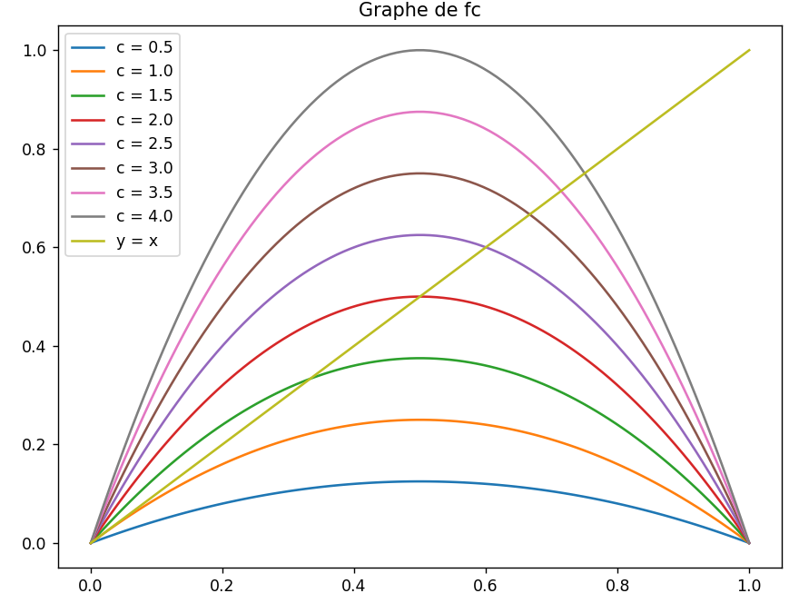
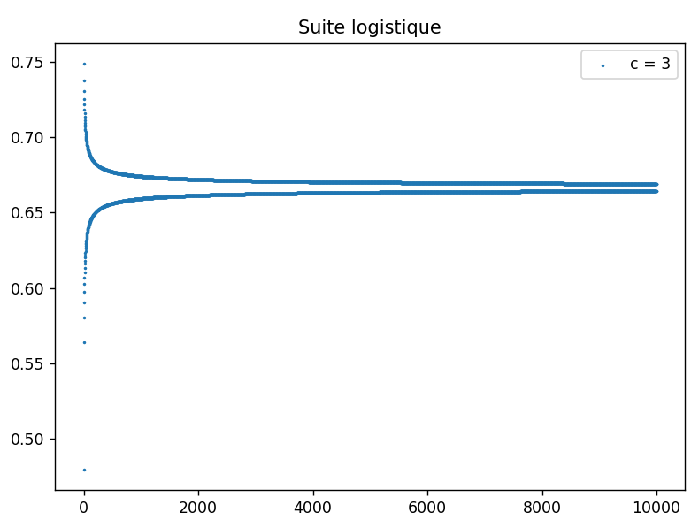
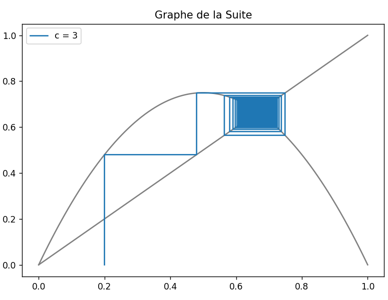

#  Compte Rendu du TP1 – Utilisation de python pour l’étude de suites

 Alexandre Clénet - Benjamin Couet / Groupe 2

 ## Exercice 1.1 – Suite logistique
### `Fonction Fc` :
```py
def ex1_1_1():
    x=np.linspace(0,1,100)
    fig, ax = plt.subplots()
    plt.tight_layout()
    c=np.linspace(0.5,4,8)
    for c in c:
        ax.plot(x,c*x*(1-x),label="c = {}".format(c))

    ax.plot(x,x,label="y = x")
    ax.set_title("Graphe de fc")
    plt.legend()
    plt.show()
```

### `Fonction Logistique` :
```py
def logistique(c, a, N):
    x=np.arange(N)
    y=[]
    fig, ax = plt.subplots()
    for i in range(N):
        res = c*a*(1-a)
        a=res
        y.append(res)
    ax.scatter(x,y,label="c = {}".format(c),s=1)

    ax.set_title("Suite logistique")
    plt.tight_layout()
    plt.legend()
    plt.show()
```
logistique(3,0.2,10000) :

### `Fonction GraphLogistique` :
```py
def GraphLogistique(c, a, N):
    x2=np.linspace(0,1,100)
    x=[]
    y=[]
    fig, ax = plt.subplots()
    for i in range(N):
        x.append(a)
        x.append(a)
        res = c*a*(1-a)
        y.append(a)
        y.append(res)
        a=res
    y[0]=0
    ax.plot(x2,c*x2*(1-x2),color="grey")
    ax.plot(x2,x2,color="grey")
    ax.plot(x,y,label="c = {}".format(c))

    ax.set_title("Graphe de la Suite")
    plt.tight_layout()
    plt.legend()
    plt.show()
```
GraphLogistique(3,0.2,10000) :
