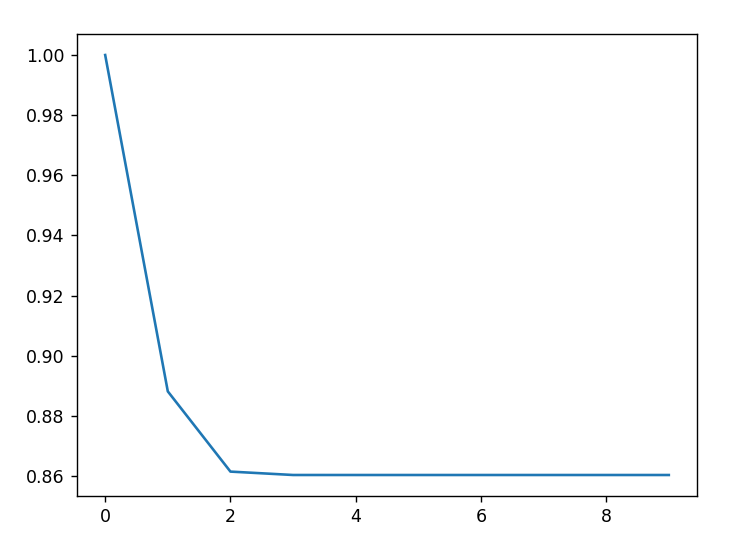
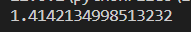
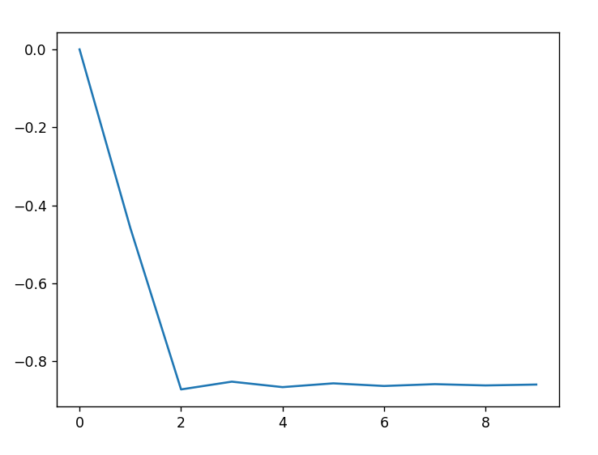

#  Compte Rendu du TP 2 – Résolutions d’équations

 Alexandre Clénet - Benjamin Couet / Groupe 2

### Importation
```py
import numpy as np
import matplotlib.pyplot as plt
```
## Exercice 2.1 – Dichotomie
### Les `Fonctions Python` :
```py
def dichotomie(a,b,e):
    it=0
    while abs(b-a)>e:
        it+=1
        m=(a+b)/2
        if (fonction(a)*fonction(m)>0):
            a=m
        else:
            b=m
        print(a,b,"itération n°",it)
    return b
```
### Les `Resultats` :
Test de `dichotomie(0, np.pi, 0.00000001)` avec la fonction 𝑥*tan(𝑥)-1       


## Exercice 2.3 – Méthode de Newton
### Les `Fonctions Python` :
```py
def Newton(x0, N):
    for i in range(N):
        x0=x0-(f(x0)/df(x0))
    return x0

def VitesseNewton():
    y=[]
    for i in range(10):
        y.append(Newton(1, i)) 
    x=np.arange(len(y))
    plt.plot(x, y) 
    plt.show() 
```
### Les `Resultats` :
Test de `Newton(10, 10)` avec la fonction 𝑥² − 2 :    
   
Test de `VitesseNewton()` avec la fonction 𝑥*tan(𝑥)-1 :     

## Exercice 2.4 – Méthode de la sécante
### Les `Fonctions Python` :
```py
def Secante(x0,x1,N):
    for i in range(N):
        t1=(f(x1)-f(x0))/(x1-x0)
        x0=x1-(f(x1)/t1)
    return x0

def VitesseSecante():
    y=[]
    for i in range(10):
        y.append(Secante(0,2, i)) 
    x=np.arange(len(y))
    plt.plot(x,y)
    plt.show()
```
### Les `Resultats` :
Test de `Secante(0,2,10)` avec la fonction 𝑥² − 2     :  
       
Test de `VitesseSecante()` avec la fonction 𝑥*tan(𝑥)-1    :  
