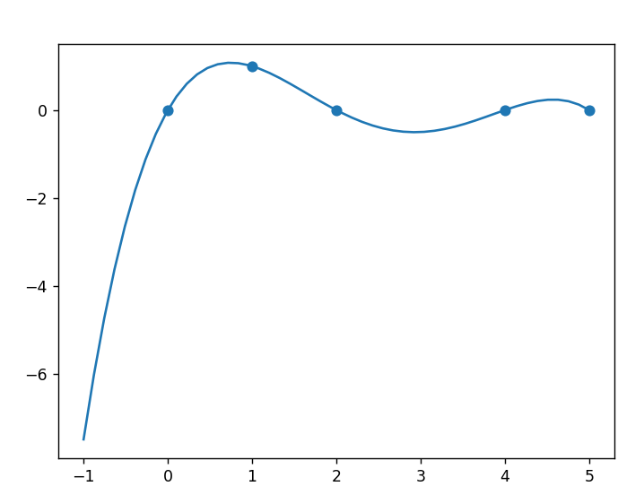
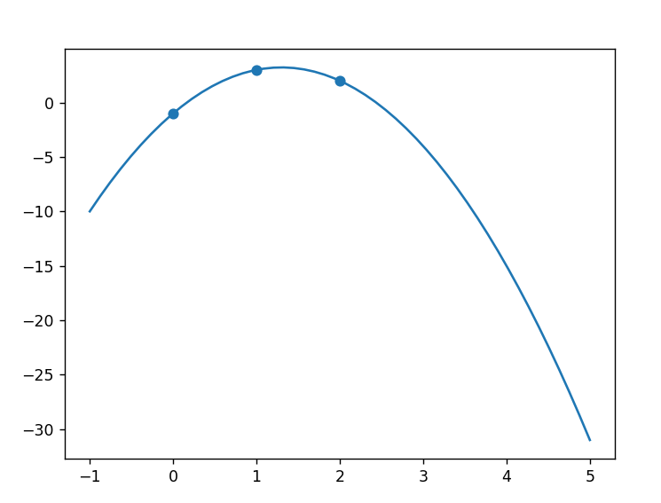
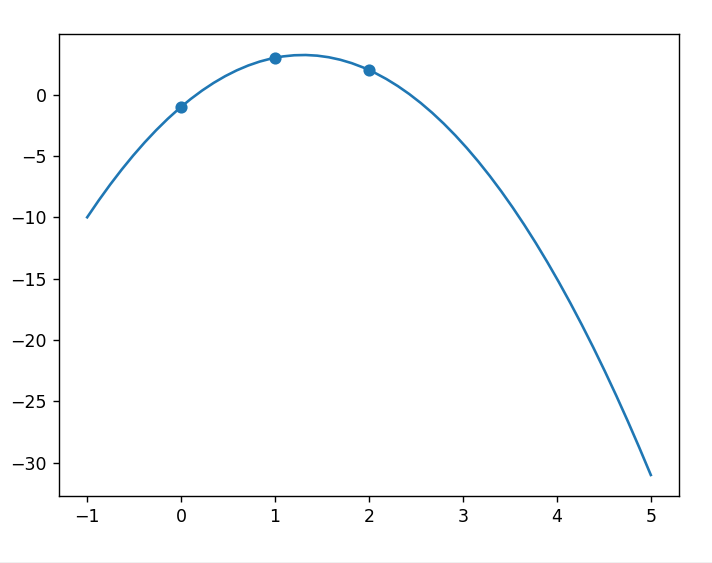

#  Compte Rendu du TP 3 – Interpolation polynomiale

 Alexandre Clénet - Nathan Marie / Groupe 2

### Importation
```py
import time
import numpy as np
import matplotlib.pyplot as plt
```
## Polynômes de Lagrange
### Les `Fonctions Python` :
```py
def BaseLagrange(X,listX,i):
    reshaut=1
    resbas=1
    for j in range(len(listX)):
        if j!=i:
            reshaut*=X-listX[j]
            resbas*=listX[i]-listX[j]
    return reshaut/resbas

def InterLagrange1(X,listX,listY):
    res=0
    for i in range(len(listY)):
        res+=listY[i]*BaseLagrange(X,listX,i)

    return res
```
### Les `Resultats` :
```py
listX=[0,1,2,4,5]
xxx=np.linspace(-1,5)
yyy= BaseLagrange(xxx,listX,1)
plt.plot(xxx,yyy)
plt.scatter(listX,[0,1,0,0,0])
plt.show()
```

```py
listX=[0,1,2,4,5]
xxx=np.linspace(-1,5)
yyy= BaseLagrange(xxx,listX,1)
plt.plot(xxx,yyy)
plt.scatter(listX,[0,1,0,0,0])
plt.show()
```


## Algorithme de Horner
### Les `Fonctions Python` :
```py
def EvalP(b,listCoef):
    res=0
    for i in range(len(listCoef)):
        res+=listCoef[i]*b**i
    return res

def Horner(b,listCoef):
    res=0
    for i in range(len(listCoef)-1,-1,-1):
        res=listCoef[i]+b*res
    return res

def compare():
    start = time.time()
    for i in range(100000):
        EvalP(2,[5,5,2,1])
    end = time.time()
    elapsed1 = end - start
    start = time.time()
    for i in range(100000):
        Horner(2,[5,5,2,1])
    end = time.time()
    elapsed2 = end - start
    return "Temps EvalP :",elapsed1,"Temps Horner :",elapsed2
```
### Les `Resultats` :
```py
#Validation de Horner
# print(EvalP(2,[1,2,3])) --> 17
# print(Horner(2,[1,2,3])) --> 17
# print(EvalP(2,[5,5,2,1])) --> 31
# print(Horner(2,[5,5,2,1])) --> 31
# print(compare()) --> ('Temps EvalP :', 0.25246453285217285, 'Temps Horner :', 0.2098073959350586)
# 
```
## Polynômes de Lagrange n°2
### Les `Fonctions Python` :
```py
def DifferencesDivisees(listX,listY):
    listcoeff=listY.copy()
    for i in range (len(listX)):
        for j in range(len(listcoeff)-1,i,-1):
            listcoeff[j]=(listcoeff[j]-listcoeff[j-1])/(listX[j]-listX[j-i-1])
    return listcoeff

def InterLagrange2(X,listX,listY):
    DD=DifferencesDivisees(listX,listY)
    res=0
    for y in range(len(DD)):
        a=DD[y]
        for i in range(y):
            a*=X-listX[i]
        res+=a
    return res
```
### Les `Resultats` :
```py
listX=[0,1,2]
listY=[-1,3,2]
xxx=np.linspace(-1,5)
yyy= InterLagrange2(xxx,listX,listY)
plt.plot(xxx,yyy)
plt.scatter(listX,listY)
plt.show()
```
