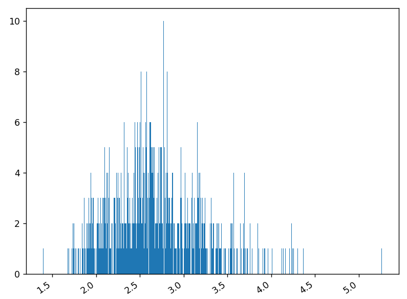
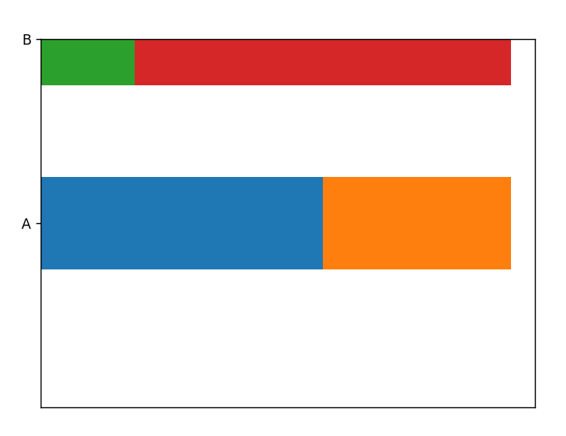

#  Compte Rendu du TP1 - OUTILS NUMÉRIQUES POUR LES STATISTIQUES DESCRIPTIVES

 Alexandre Clénet - Benjamin Couet / Groupe 2
 

## Exercice 1.1 – Consommation des ménages 
Le but de cet exercice est de faire des premières
visualisations de données. Vous allez utiliser les données présentes dans le fichier suivant :
`consommation_menages.csv` .
#### `Importation` et `données` :
```py
import pandas as pd
import matplotlib.pyplot as plt
import numpy as np
data = pd.read_csv('consommation_menages.csv', sep=',',decimal=',')
```
### 1. Que renvoient les commandes suivantes :
```py
data  #Renvoie l'ensemble des données du fichier csv
type(data)  #Renvoie le type des données "<class 'pandas.core.frame.DataFrame'>"
data.info   #Renvoie l'ensemble des données du fichier csv "<bound method DataFrame.info of ........ >"
data.Fonction   #Renvoie les différents noms de fonctions de la colonne Fonction
data.1960    #Renvoie une erreur car le . n'est pas effectif sur des nombres
data['Fonction']   #Renvoie les différents nom de fonctions de la colonne Fonction
data['1960']   #Renvoie les différentes données de la colonne 1960
data[['1960','2020']]   #Renvoie les différentes données des colonnes 1960 et 2020
```

### 1. Représenter par un diagramme en barres verticales le contenu de la colonne ’1960’.
#### Code `Python` :
```py
def ex1_1_1():
    fig, ax = plt.subplots()
    plt.xticks(rotation=35,ha="right")
    ax.bar(data['Fonction'], data['1960'])
    plt.tight_layout()
    ax.set_title("Consomation des ménages en 1960")
    plt.show()
```
#### `Résultat` :

### 2. Représenter par un diagramme camembert le contenu de la colonne ’2020’ 
#### Code `Python` :
```py
def ex1_1_2():
    fig, ax = plt.subplots()
    ax.pie(data['2020'],  labels=data['Fonction'], autopct='%1.1f%%')
    ax.set_title("Consomation des ménages en 2020")
    plt.show()
```
#### `Résultat` :

### 3. Représenter par un diagramme en barres verticales les données correspondantes aux années
#### Code `Python` :
```py
def ex1_1_3():
    width=0.35
    fig, ax = plt.subplots()
    plt.xticks(rotation=35,ha="right")
    b1=ax.bar(np.arange(len(data['Fonction']))- width/2, data['1960'],width, label='1960')
    b2=ax.bar(np.arange(len(data['Fonction']))+ width/2, data['2020'],width, label='2020')
    ax.set_xticks(np.arange(len(data['Fonction'])))
    ax.set_xticklabels(data['Fonction'])
    ax.set_title("Consomation des ménages en 1960 et 2020")
    plt.tight_layout()
    plt.show()
```
#### `Résultat` :


## Exercice 1.2 – Temps de vie de cartes mères
Un fabriquant de cartes mères teste la durée
de vie de son produit phare. Les durée de vie (temps écoulé entre la première mise en tension et
la première panne) d’un échantillon des cartes produites sont fournies dans le fichier
`temps_de_vie.csv` .
#### `Importation` et `données` :
```py
import pandas as pd
import matplotlib.pyplot as plt
data = pd.read_csv('temps_de_vie.csv', sep=',')
```
#### Code `Python` :
```py
def ex1_1_3():
    width=0.35
    fig, ax = plt.subplots()
    b1=ax.bar(np.arange(len(data['Fonction']))- width/2, data['1960'],width, label='1960')
    b2=ax.bar(np.arange(len(data['Fonction']))+ width/2, data['2020'],width, label='2020')
    ax.set_title("Consomation des ménages en 1960 et 2020")
    plt.tight_layout()
    plt.show()
```
#### `Résultat` :


## Exercice 1.3 – Pyramide des âges
Le but de cet exercice est de construire la pyramide des
âges française. Pour cela, on utilisera le fichier
`pyramide_ages.csv `.
#### `Importation` et `données` :
```py
import pandas as pd
import matplotlib.pyplot as plt
data = pd.read_csv('pyramide_ages.csv', sep=',',decimal=',')
```

### 1. Que renvoient les commandes suivantes :
```py
data.columns  #Renvoie le nom de toutes les colonnes
data['age']  #Renvoie les différents age de la colonne age
data[data['age']<60]  #Renvoie l'ensemble des données pour un age < 60
```
### 2. Pour représenter des données sous forme de barres horizontales, on utilise la commande ax.barh. Afin de comprendre son fonctionnement, on regardera l’effet des commandes suivantes :
#### Code `Python` :
```py
def ex1_3_2():
    fig, axes = plt.subplots(1,1)
    axes.barh(y=1, width = 3, height = 0.5)
    axes.barh(y=2, width = 1, height = 0.5)
    plt.show()
```
#### `Résultat` :

### 3. En utilisant la méthode barh, affcher la pyramide des âges suivante.
#### Code `Python` :
```py
def ex1_3_3():
    fig, axes = plt.subplots()
    axes.barh(data['age'],data['2019_F'],label='Femme')
    axes.barh(data['age'],-data['2019_H'],label='Homme')
    axes.legend()
    axes.set_title("Pyramide des ages de 2019")
    plt.show()
```
#### `Résultat` :

### 4. En utilisant les données présentes dans ce fichier, affcher le graphique suivant, où la courbe verte correspond à la différence des effectifs.
#### Code `Python` :
```py
#Pas optimisé et les valeurs négatives encore présentes

def ex1_3_4():
    fig, (axes0,axes1,axes2) = plt.subplots(1,3)

    #1975
    axes0.barh(data['age'],data['1975_F'],label='Femme')
    axes0.barh(data['age'],-data['1975_H'],label='Homme')
    axes0.plot(data['1975_F']-data['1975_H'],data['age'],label="Différence",color="green")
    axes0.set_title("1975")
    axes0.set_ylabel('Age', loc='top')
    axes0.set_xlabel('Pop', loc='left')
    axes0.spines['left'].set_position('zero')
    axes0.spines['right'].set_color('none')
    axes0.spines['top'].set_color('none')
    axes0.set_ylim(bottom=0)

    #1999
    axes1.barh(data['age'],data['1999_F'],label='Femme')
    axes1.barh(data['age'],-data['1999_H'],label='Homme')
    axes1.plot(data['1999_F']-data['1999_H'],data['age'],label="Différence",color="green")
    axes1.set_title("1999")
    axes1.set_ylabel('Age', loc='top')
    axes1.set_xlabel('Pop', loc='left')
    axes1.spines['left'].set_position('zero')
    axes1.spines['right'].set_color('none')
    axes1.spines['top'].set_color('none')
    axes1.set_ylim(bottom=0)

    #2020
    axes2.barh(data['age'],data['2019_F'],label='Femme')
    axes2.barh(data['age'],-data['2019_H'],label='Homme')
    axes2.plot(data['2019_F']-data['2019_H'],data['age'],label="Différence",color="green")
    axes2.set_title("2019")
    axes2.set_ylabel('Age', loc='top')
    axes2.set_xlabel('Pop', loc='left')
    axes2.spines['left'].set_position('zero')
    axes2.spines['right'].set_color('none')
    axes2.spines['top'].set_color('none')
    axes2.set_ylim(bottom=0)

    fig.suptitle("Pyramide des ages en France")
    axes1.legend(loc='lower center', bbox_to_anchor=(0.5, -0.2, 0., 0.5),ncol=3)
    fig.tight_layout()
    plt.show()
```
#### `Résultat` :


## Exercice 1.4 – Mobilité sociale
Le but de cet exercice est de construire deux graphiques illustrant la destinée sociale d’individus en fonction de la
catégorie sociale de leur pŁre. Vous devrez utiliser les fichiers suivants
`mobilite_sociale_Insee.ods` et `TP1_mobilite_sociale.py` .
#### `Importation` et `données` :
```py
import matplotlib.pyplot as plt
import TP1_mobilite_sociale as do #données sous forme de dictionnaire
```
### 1. La méthode .barh est assez permissive : on peut lui faire prendre des chaînes de caractères en la variable y. Constatons cela avec les commandes suivantes. À quoi sert l’argument left ?
#### Code `Python` :
```py
def ex1_4_1():
    fig, ax = plt.subplots()
    ax.barh(y='A', width = 3, left= 0, height = 0.5)
    ax.barh(y='A', width = 2, left= 3, height = 0.5)
    ax.barh(y='B', width = 1, left= 0, height = 0.5)
    ax.barh(y='B', width = 4, left= 1, height = 0.5)
    plt.show()
```
#### `Résultat` :
L'argument `left` sert ici de faire le `décalage` pour superposer les barh.

### 2. Reprenez les lignes ci-dessus et ajoutez les lignes suivantes. Que se passe-t-il ?
#### Code `Python` :
```py
def ex1_4_2():
    fig, ax = plt.subplots()
    ax.barh(y='A', width = 3, left= 0, height = 0.5)
    ax.barh(y='A', width = 2, left= 3, height = 0.5)
    ax.barh(y='B', width = 1, left= 0, height = 0.5)
    ax.barh(y='B', width = 4, left= 1, height = 0.5)
    ax.set_ylim(-1,1)
    ax.xaxis.set_visible(False)
    plt.show()
```
#### `Résultat` :
Les `graduations` sur l'axe des abscisses `disparaissent` et l'axe des ordonnées est fixé entre `-1 et 1`, ici 1 étant B et A 0.

### 3. Produisez le graphique suivant en vous servant des données ci-dessous.
#### Code `Python` :
```py
def ex1_4_3():
    agriculteur = [27.6, 9.0, 12.2, 14.8, 26.0, 10.4]
    category_colors = ["tab:olive","tab:purple",
    "tab:blue","tab:cyan", "tab:brown","tab:orange"]
    fig, ax = plt.subplots(figsize=(8, 5))
    add=0
    for i in range(len(agriculteur)):
        ax.barh(y='Agriculteur', width = agriculteur[i],color= category_colors[i], left= add, height = 0.5)
        add+=agriculteur[i]
    ax.set_ylim(-1,1)
    ax.set_title("Catégorie socioprofessionelle \ndes hommes ayant un père agriculteur")
    ax.legend([do.category_names[0],do.category_names[1],do.category_names[2],do.category_names[3],do.category_names[4],do.category_names[5]],loc='center left', bbox_to_anchor=(1, 0.5))
    ax.xaxis.set_visible(False)
    plt.tight_layout()
    plt.show()
```
#### `Résultat` :

### 4. Utiliser les données complètes, fournies dans le début du TP, afin de générer le diagramme suivant.
#### Code `Python` :
```py
def ex1_4_4():
def ex1_4_4():
    category_colors = ["tab:olive","tab:purple",
    "tab:blue","tab:cyan", "tab:brown","tab:orange"]
    fig, ax = plt.subplots(2,1,figsize=(13, 7))
    
    ax[0].set_title("CSP des hommes en fonction de la CSP de leur père")
    for nom,données in do.resultsHomme.items():
        add=0
        for i in range(len(données)):
            a=ax[0].barh(y=nom, width = données[i],color= category_colors[i], left= add, height = 0.5)
            ax[0].bar_label(a, label_type='center')
            add+=données[i]
    
    
    ax[1].set_title("CSP des femmes en fonction de la CSP de leur père")
    for nom,données in do.resultsFemme.items():
        add=0
        for i in range(len(données)):
            a=ax[1].barh(y=nom, width = données[i],color= category_colors[i], left= add, height = 0.5)
            ax[1].bar_label(a, label_type='center')
            add+=données[i]


    ax[0].legend([do.category_names[0],do.category_names[1],do.category_names[2],do.category_names[3],do.category_names[4],do.category_names[5]],loc='center left', bbox_to_anchor=(1, 0.5))
    ax[0].xaxis.set_visible(False)
    ax[1].xaxis.set_visible(False)
    plt.tight_layout()
    plt.show()
```
#### `Résultat` :
