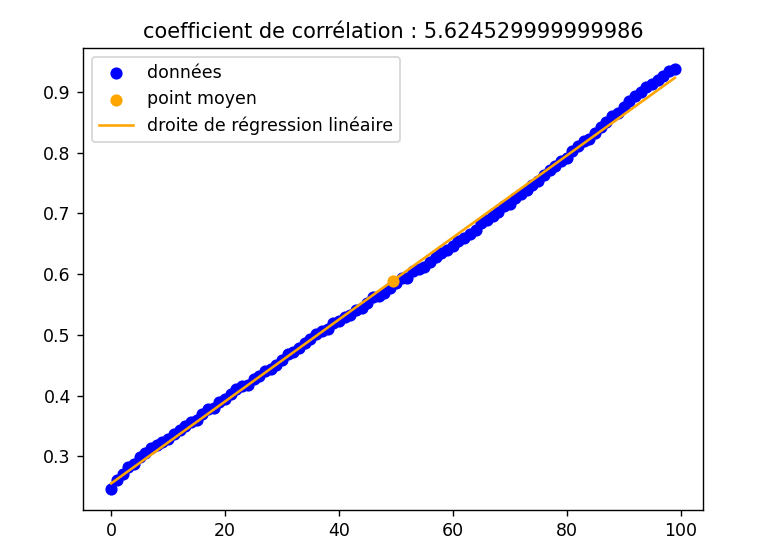
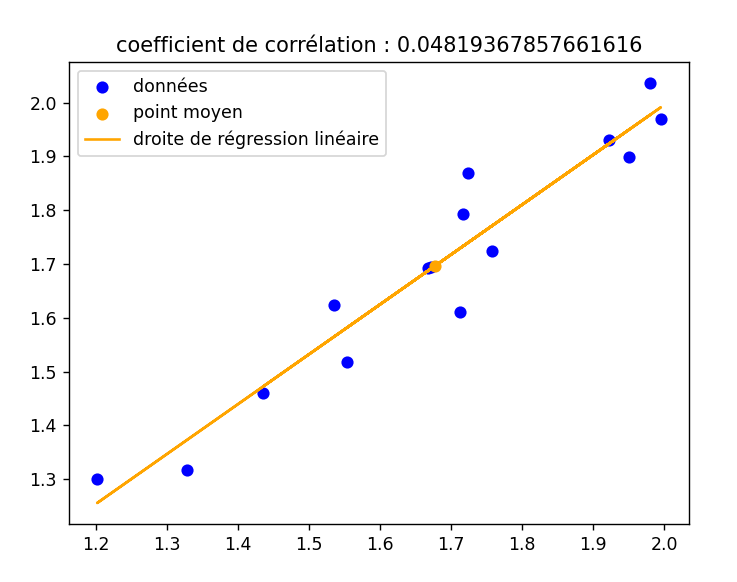
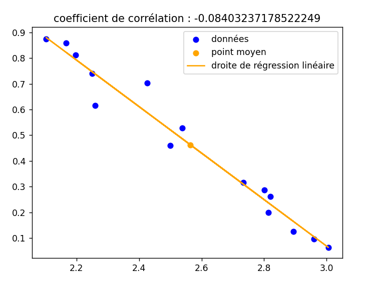
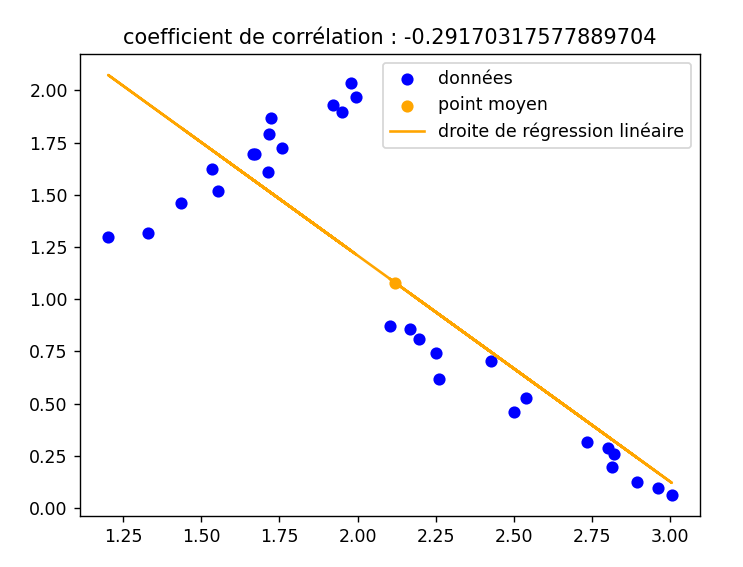
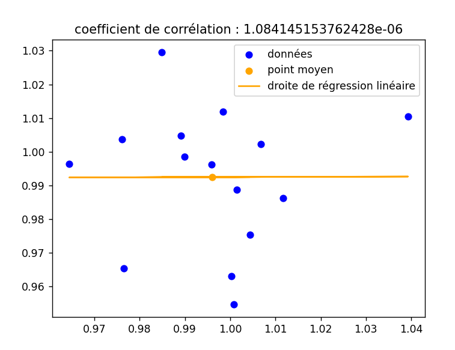
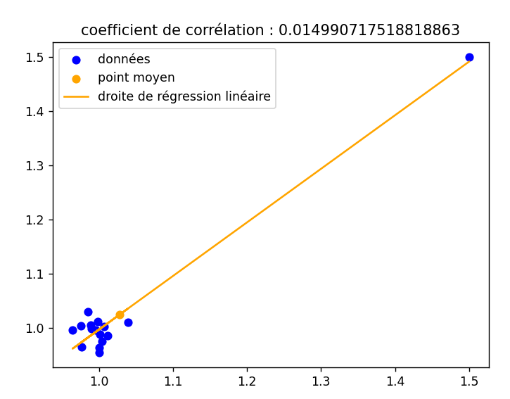
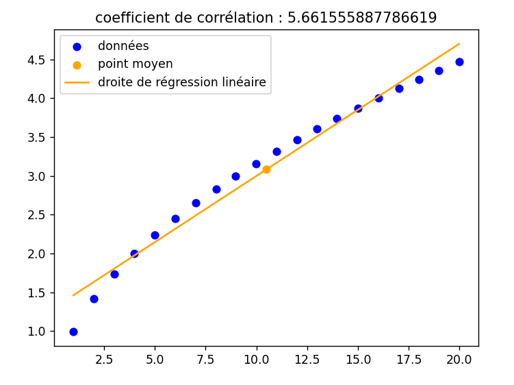
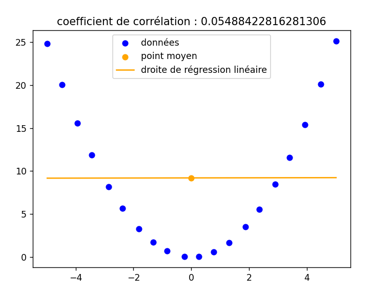
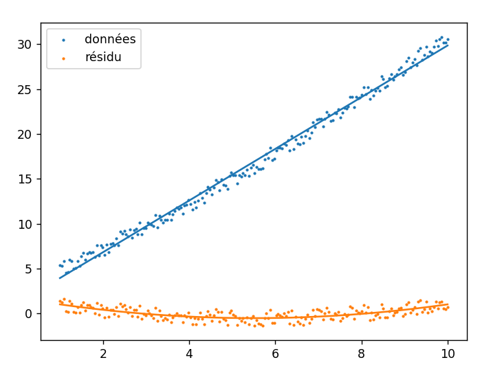

#  Compte Rendu du TP2 - OUTILS NUMÉRIQUES POUR LES STATISTIQUES DESCRIPTIVES

 Alexandre Clénet - Benjamin Couet / Groupe 2
 

## Exercice 2.1 – Premier exemple de correlation linéaire 
On considère 𝑋 et 𝑌 deux listes
de nombres de même taille.
#### `Importation` et `données` :
```py
import csv as csv
import matplotlib.pyplot as plt
```
### 1. Quelques fonctions préliminaires :

#### a) Écrire une fonction point_moyen(X,Y) qui renvoie les coordonnées du point moyen des séries statistiques 𝑋 et 𝑌 .
```py
def point_moyen(X,Y):
    moyX=sum(X)/len(X)
    moyY=sum(Y)/len(Y)
    return moyX,moyY 
```
#### b) Écrire une fonction coeff_corr(X,Y) qui renvoie le coefficient de corrélation des séries statistiques 𝑋 et 𝑌 .
```py
def coeff_corr(X,Y):
    add=0
    for i in range(len(X)):
        add+=X[i]*Y[i]
    add=add/len(X)
    mX,mY=point_moyen(X,Y)
    return add-mX*mY  
```
#### c) Écrire une fonction coeffs_droite_reg(X,Y) qui renvoie les coefficients 𝑎 et 𝑏 de la droite de régression linéaire (d’équation 𝑦 = 𝑎𝑥 + 𝑏) des séries statistiques 𝑋 et 𝑌 .
```py
def coeffs_droite_reg(X,Y):   
    mX,mY=point_moyen(X,Y)
    a=coeff_corr(X,Y)/coeff_corr(X,X)
    b=mY-(coeff_corr(X,Y)/coeff_corr(X,X)*mX)
    return a,b
```
#### d) Écrire une fonction etude(X,Y) .
```py
def etude(X,Y):
    ig, ax = plt.subplots()
    mX,mY=point_moyen(X,Y)
    ax.scatter(X, Y,color='blue',label='données')
    ax.scatter(mX, mY,color='Orange',label='point moyen')
    a,b=coeffs_droite_reg(X,Y)
    correc=[]
    for i in X:
        correc.append(a*i+b)
    ax.plot(X, correc,color='Orange',label='droite de régression linéaire')
    ax.set_title(f"{coeff_corr(X,Y)}")
    plt.legend()
    plt.show()
```

### 2. Un exemple concret : On fournit dans le fichier `PercenRevParlVSEtude.csv`
#### Pour ouvrir le `csv` :
```py
def csvopen(A):
    with open(A, newline='') as csvfile:
        data = csv.reader(csvfile, delimiter=',')
        Liste=[]
        for row in data:
            Liste.append(list(row))
        for i in range(1,len(Liste)):
            Liste[i] = [float(s.replace(',','.')) for s in Liste[i]] 

        Lx=[]
        Ly=[]
        for i in range(1,len(Liste)):
            Lx.append(Liste[i][0])
            Ly.append(Liste[i][1])
    return Lx,Ly
```
#### `Résultat` :


### 3. Générations d’exemples types : La fin de l’exercice est pour illustrer le fait qu’il faut considérer le coefficient de corrélation avec précaution.
#### Pour ouvrir le `csv` :
```py
def csvopen(A):
    with open(A, newline='') as csvfile:
        data = csv.reader(csvfile, delimiter=',')
        Liste=[]
        for row in data:
            Liste.append(list(row))
        for i in range(1,len(Liste)):
            Liste[i] = [float(s) for s in Liste[i]] 

        Lx=[]
        Ly=[]
        for i in range(1,len(Liste)):
            Lx.append(Liste[i][0])
            Ly.append(Liste[i][1])
    return Lx,Ly
```
#### a) On considère les données présentes dans les fichiers ExAsetA.csv et ExAsetB.csv. Afficher les représentations de ces deux jeux de données ainsi que les coefficients de corrélation 𝑟1 et 𝑟𝐵 des ensembles 𝐴 et 𝐵 ainsi que le coefficient de corrélation de l’ensemble 𝐴 ∪ 𝐵.

#### `A` :

#### `B` :

#### `𝐴 ∪ 𝐵` :

#### b) On considère les points dont les coordonnées sont stockées dans le fichier ExBsetA.csv. Représenter les données et faire apparaître le coefficient de corrélation. On considère un nouveau point dont les coordonnées sont contenues dans le fichier ExBsetB.csv. Représenter l’ensemble 𝐴 ∪ 𝐵 et faire apparaître le coefficient de corrélation.
#### `A` :

#### `𝐴 ∪ 𝐵` :

#### c) Sur ces deux dernier exemples, on va illustrer le fait que le coefficient de correlation mesure un lien linéaire entre deux caractères. Représenter les données des fichiers ExCsetA.csv et ExCsetB.csv.

#### `A` :

#### `B` :


## Exercice 2.2 – Des données "trompeuses" 
On veut étudier la série statistique à deux variables
stockée dans le fichier suivant :
`regLinData.dat`

#### Code `Python` :
```py
import numpy as np
import matplotlib.pyplot as plt
from scipy.stats import linregress

x, y = np.loadtxt("regLinData.dat", unpack=True)

regress = linregress(x, y)
coef = np.polyfit(x, y - (regress.slope*x + regress.intercept), 2)
plt.scatter(x, y, s=2, label='données')
plt.plot(x, regress.intercept + regress.slope*x)
plt.plot(x, coef[0]*x**2 + coef[1]*x + coef[2])
plt.scatter(x, y - (regress.slope*x + regress.intercept), s=2, label='résidu')
plt.legend()
plt.show()
```
#### `Résultat` :
