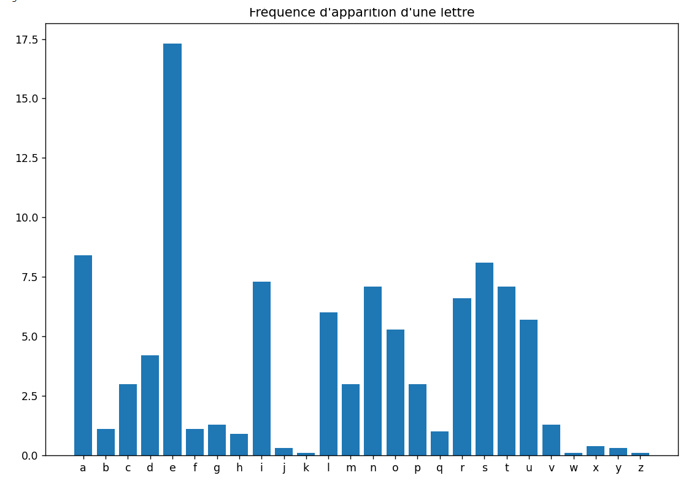
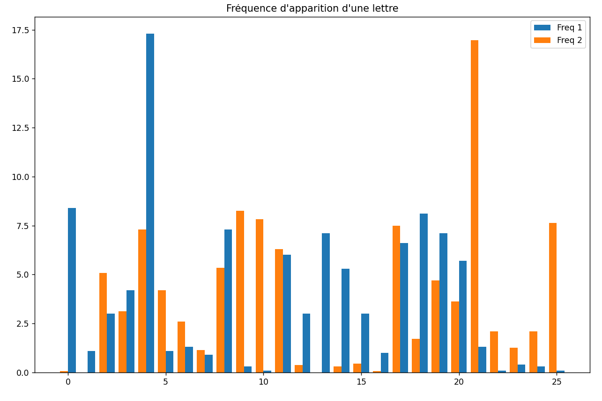
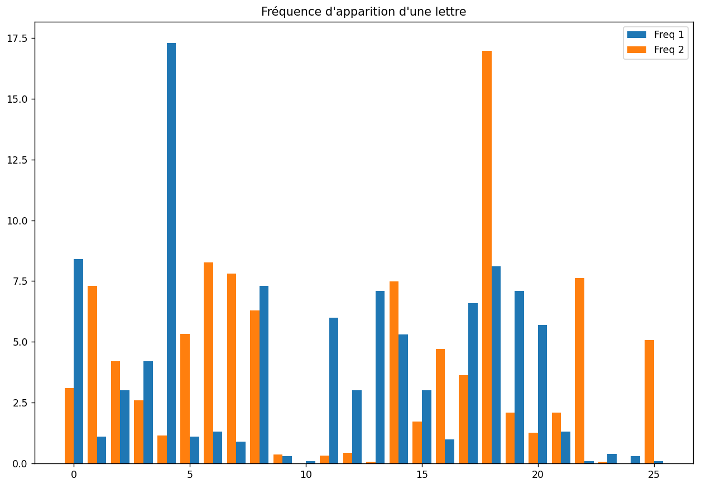
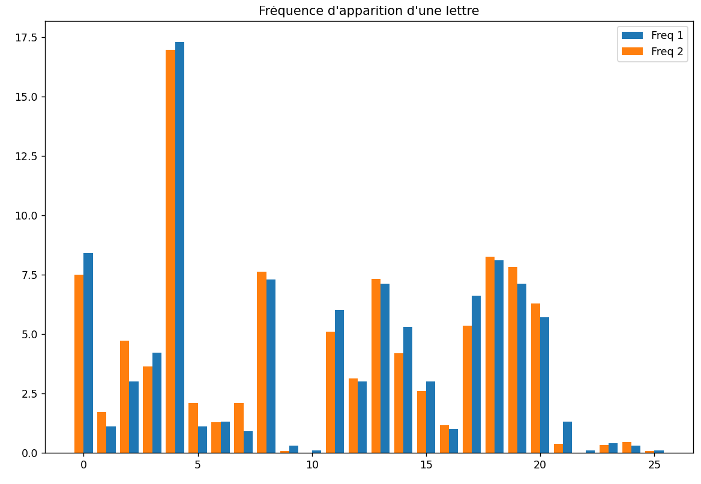
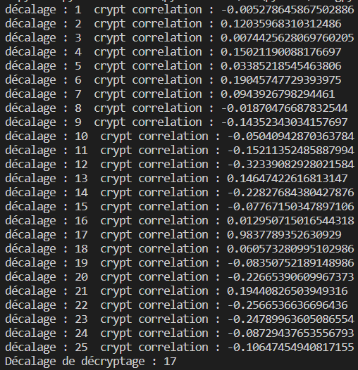
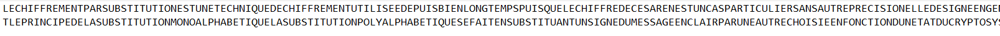
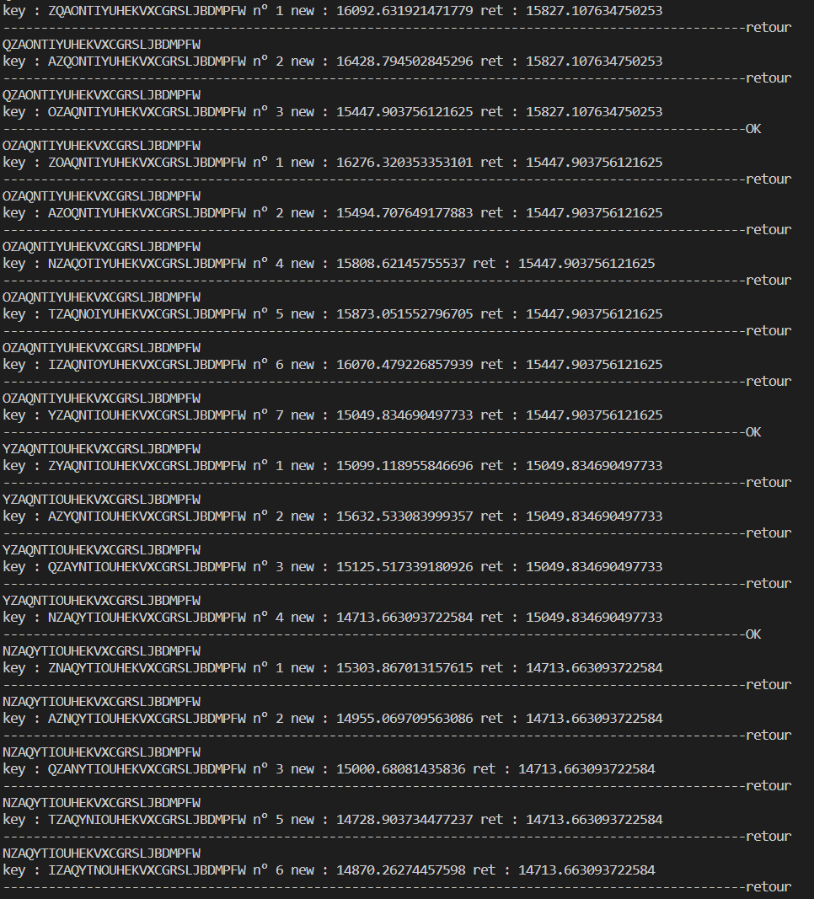
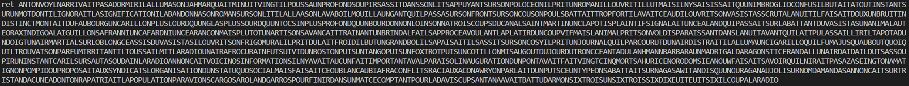

#  Compte Rendu du TP3 – Utilisation de fréquences : analyse de messages chiffrés

 Alexandre Clénet - Benjamin Couet / Groupe 2
 
## Exercice 3.1 – Un calcul de fréquence
Le but ici est de faire une `analyse fréquentielle` de textes en français afin d'étudier la fréquence des lettres de A à Z dans la `langue française`. 
```py
#IMPORTATION
import json
import unidecode

#FONCTION
def filetofreq(txt,fichier):      #VARIABLES:
    new_file = open(fichier,"w") #fichier .txt
    dictionnary ={}     
    Alphabet=['a','b','c','d','e','f','g','h','i','j','k','l','m','n','o','p','q','r','s','t','u','v','w','x','y','z',' ']

    with open(txt, "r",encoding="UTF-8") as txt:
        #mettre toutes les lettre en minuscule et sans accent
        lignes = unidecode.unidecode(txt.read().lower()) 
        
        #calcul de la fréquence de chaques lettres de l'alphabet inséré dans le dictionnaire
        for i in range(0,26):
            freqlettre=lignes.count(Alphabet[i])/(len(lignes)-lignes.count(Alphabet[26]))*100
            dictionnary[Alphabet[i]]=freqlettre
    
    #On enrengistre le dictionnaire dans un .json
    json.dump(dictionnary,new_file)
    new_file.close()   

#EXECUTION
filetofreq("Corpus/amourSwann.txt","freq_lettre_fr_approx.json")
```


## Exercice 3.2 – Chiffrement de César

### 1. Écrire une fonction caesar_crypt(msg,decal) qui prend en entrée une chaîne de caractère msg et un nombre decal et qui renvoie le message crypté à la manière de César.
```py
def caesar_crypt(msg,decal):

    new_alphabet=alphabet[decal:]+alphabet[:decal]
    new_ALPHABET=ALPHABET[decal:]+ALPHABET[:decal]
    msg_crypt=""
    for i in msg :
        if is_upper(i):
            for y in range (0, len(ALPHABET)):
                if i== ALPHABET[y]:
                    msg_crypt+=new_ALPHABET[y]
        else: 
            for y in range (0, len(alphabet)):
                if i== alphabet[y]:
                    msg_crypt+=new_alphabet[y]
    return msg_crypt
```
### 2. a) Écrire une fonction bar_freq(fichier) qui prend en entrée un nom de fichier .json contenant des fréquences de lettres en français et qui affche le diagramme en barres de ces fréquences.
```py
def bar_freq(fichier):
    dictionary = json.load(open(fichier, 'r'))
    xAxis = [key for key, value in dictionary.items()]
    yAxis = [value for key, value in dictionary.items()]

    fig, ax = plt.subplots()
    ax.bar(xAxis,yAxis)
    plt.tight_layout()
    ax.set_title("Fréquence d'apparition d'une lettre")
    plt.show()
```
Test avec la fréquence des lettres de la langue Française

### 2. b) Écrire une fonction bar_freq1_freq2(fichier1,fichier2) qui prend en entrée deux noms de fichier .json contenant deux séries de fréquences de lettres et les affchent sur le même diagramme.
```py
def bar_freq1_freq2(fichier1,fichier2):
    dictionary = json.load(open(fichier1, 'r'))
    xAxis = [key for key, value in dictionary.items()]
    yAxis = [value for key, value in dictionary.items()]
    dictionary2 = json.load(open(fichier2, 'r'))
    xAxis2 = [key for key,value in dictionary2.items()]
    yAxis2 = [value for key, value in dictionary2.items()]

    fig, ax = plt.subplots()
    ax.bar(np.arange(len(xAxis))+0.2,yAxis,0.4,label="Freq 1")
    ax.bar(np.arange(len(xAxis2))-0.2,yAxis2,0.4,label="Freq 2")
    plt.tight_layout()
    plt.legend()
    ax.set_title("Fréquence d'apparition d'une lettre")
    plt.show()
```
Test avec la fréquence des lettres de la langue Française et celle du texte crypté

### 2. c) Écrire une fonction bar_compare_freq(fichier1,fichier2,decal) qui prend en entrée deux noms de fichier .json contenant deux séries de fréquences de lettres et les affichent sur le même diagramme en ayant fait subir un décalage de decal à la seconde série.
```py
def bar_compare_freq(fichier1,fichier2,decal):
    dictionary = json.load(open(fichier1, 'r'))
    xAxis = [key for key, value in dictionary.items()]
    yAxis = [value for key, value in dictionary.items()]
    dictionary2 = json.load(open(fichier2, 'r'))
    xAxis2 = [key for key,value in dictionary2.items()]
    yAxis2 = [value for key, value in dictionary2.items()]
    yAxis2=yAxis2[decal:]+yAxis2[:decal]

    fig, ax = plt.subplots()
    ax.bar(np.arange(len(xAxis))+0.2,yAxis,0.4,label="Freq 1")
    ax.bar(np.arange(len(xAxis2))-0.2,yAxis2,0.4,label="Freq 2")
    plt.tight_layout()
    plt.legend()
    ax.set_title("Fréquence d'apparition d'une lettre")
    plt.show()
```
Meme Test avec cette fois la 2eme fréquence décalé de 3 lettres

### 2. d) À l’aide de cette dernière fonction, essayez de décrypter le texte crypté contenu dans le fichier encrypted_with_caesar.txt
```py
def manualdecrypt(fichier1,fichier2):
    for i in range(1,26):
        print("décalage :",i) 
        bar_compare_freq(fichier1,fichier2,i)
```
Cette fois on effectue le test plusieurs fois avec les 25 décalages possibles jusqu'à obtenir les 2 fréquences superposées. Ici le décalage est de 17 

### 3. Vous avez réussi à déterminer graphiquement quel était l’entier 𝑘 ∈ J1, 25K utilisé pour chiffrer le texte précédent avec le chiffrement de César. On va essayer d’automatiser cette recherche.
### 3. a) Écrire une fonction correlation_freqs(fichier) qui prend en entrée un nom de fichier contenant les fréquences d’apparition des lettres dans un texte chiffré avec César et qui calcule, pour chaque entier 𝑛 ∈ J0, 25K, le coeffcient de corrélation entre les fréquences des lettres en français et celles contenues dans fichier décalées de 𝑛. La fonction renvoie le graphe de ces coeffcients de correlations en fonction de 𝑛.
```py
#POUR COEFFICIENT CORRECTEUR
def moy(x):
    add=0
    for e in x:
        add+=e
    return add/len(x)

def covar(X,Y):
    som=0
    if len(X) == len(Y):
        for i in range(0,len(X)):
            a=(X[i]-moy(X)) * (Y[i]-moy(Y))
            a/=len(X)
            som+=a
            a=0
        return som
    else:
        return "error"

def variance(X):
    a=0
    for i in range(0,len(X)):
        a+=(X[i]-moy(X))**2
    return a*(1/len(X))

def coeff_corr(X,Y):
    return covar(X,Y)/(math.sqrt(variance(X)*variance(Y)))

#LA FONCTION
def correlation_freqs(fichier1,fichier2):
    dictionary = json.load(open(fichier1, 'r'))
    yAxis = [value for key, value in dictionary.items()]
    dictionary2 = json.load(open(fichier2, 'r'))
    yAxis2 = [value for key, value in dictionary2.items()]

    corr=-1
    decal=0

    for i in range(1,26):
        yAxis2=yAxis2[1:]+yAxis2[:1]
        print("décalage :",i," crypt correlation :",coeff_corr(yAxis,yAxis2))
        if corr<coeff_corr(yAxis,yAxis2):
            decal=i
            corr=coeff_corr(yAxis,yAxis2)
    print("Décalage de décryptage :", decal)
    return decal
```
Pour tous les décalages, on retient celui qui est le plus proche de 1

### 3. b) En modifiant la fonction précédente, écrire une fonction decrypt(fichier) qui prend en entrée un fichier avec un texte crypté et qui crée un fichier contenant le message de fichier déchiffré.
```py
def decrpt(fichier):
    filetofreq(fichier,"freq.json")
    with open(fichier,"r",encoding="UTF-8") as txt:
        new_file = open("decrypted_with_caesar.txt","w")
        str=txt.read()
        strdecry=caesar_crypt(str,-correlation_freqs("freq_lettre_fr.json","freq.json"))
        new_file.write(strdecry)
        new_file.close()
```
Une fois qu'on a retrouvé le bon décalage il suffit de recrypté dans le sens inverse puis il est enrengistrer dans un fichier .txt

## Exercice 3.3 – Chiffrement par substitution

### 1. Écrire une fonction crypt(msg) qui prend en entrée un message textuel msg, qui supprime toute ponctuation, espace ou accents, mettant toutes les lettres en majuscule et qui renvoie le message en l’ayant crypté grâce à un choix aléatoire de permutation des lettres.
```py
def crypt(msg) :
    new=msg.replace(' ','')
    new = unidecode.unidecode(new)
    new=new.upper()
    c=list(new)
    random.shuffle(c)
    return ''.join(c)
```
### 2. Combien y-a-t-il de chiffrements possibles avec cette méthode ? Est-il raisonnable de vouloir déchiffrer ce message en essayant tous les chiffrements possibles ?
Il y a `26! possiblités` soit `4.0329146e+26 possibilités` c'est donc absolument `absurde` de vouloir tout tester
### 3. En utilisant le code de la précédente fonction, écrire une fonction chiffre(msg,key) qui prend en entrée une chaîne de caractères msg et une clé key et qui renvoie la chaîne de caractère chiffré grâce à la clé.
```py
def chiffre(msg,key):
    ALPHABET=string.ascii_uppercase
    new=msg.lower()
    new=new.replace(' ','')
    new = unidecode.unidecode(new)
    new=new.upper()
    for i in range(0,len(new)):
        for y in range(0,len(ALPHABET)):
            if new[i]==ALPHABET[y]:
                new = new[:i] + key[y] + new[i+1:]
                break
    return new
```
### 4. On commence par étudier les fréquences de chacune des lettres du texte. Calculer les fréquences d’apparition de chaque lettre et à la manière de l’exercice 2, essayez de décoder le texte.
Comme à convenu cela ne marche pas ou alors il faudrait que par chance que le texte chiffré le soit à la manière de César ce qui n'est pas le cas ici.

### 5. Écrire une fonction qui lit le fichier quadrigrammes.txt et qui renvoie un dictionnaire {"quad": N} qui possède chaque quadrigramme en clé et le nombre d’occurrences. Faites en sorte que cette fonction sauvegarde ce dictionnaire dans un fichier .json. On retiendra ce dictionnaire dans une variable globale DICT_QUAD.
```py
def dictquad(text):
    new_file = open("dictquad.json","w")
    with open(text, "r",encoding="UTF-8") as txt:
        lignes = txt.readlines()
        for ligne in lignes:
            DICT_QUAD[ligne[0:4]]=int(ligne[5:].replace("\n","")) 
        
    json.dump(DICT_QUAD,new_file)
    new_file.close()  
```
### 6. On commence par générer une clef key aléatoire avec laquelle on déchiffre le texte et on calcule son logscore ;
```py
key=crypt(string.ascii_uppercase)
```
### 7. On considère toutes les clefs voisines key. Une clé key2 est voisine de la clé key si 
### — on peut passer de key à key2 en permutant deux caractères ;
### — on peut passer de key à key2 en déplaçant un unique caractère dans la chaîne ;
```py
def neigh_keys(key):
    all_neigh_keys=[]
    for i in range(0,len(key)):
        for j in range(i,len(key)):
            if j!=i:
                new_key=key[:i]+key[j:j+1]+key[i+1:j]+key[i:i+1]+key[j+1:]
                all_neigh_keys.append(new_key)
                new_key=key
    return all_neigh_keys

def neigh_keys_2(key):
    all_neigh_keys=[]
    for i in range(0,len(key)):
        for j in range(0,len(key)):
            if j!=i :
                if j>i:
                    new_key=key[:i]+key[i+1:j+1]+key[i]+key[j+1:]
                    all_neigh_keys.append(new_key)
                    new_key=key
                elif i>j:
                    new_key=key[:j]+key[i]+key[j:i]+key[i+1:]
                    all_neigh_keys.append(new_key)
                    new_key=key
                
    return all_neigh_keys

#Regroupement
def all_neigh_keys(keys1,keys2):
    neigh_keys=keys1
    for i in keys2:
        if (i not in neigh_keys):
            neigh_keys.append(i)
    return neigh_keys
```
### 8. On réitère le procédé avec la nouvelle clé en évitant de tester les clés présentes dans la liste OldKey.
### 9. On s’arrête lorsque l’algorithme a tourné un certain nombre de fois ou alors que la clé retenue à un logscore plus bas que toutes ces voisines.

Avec toutes les `consignes`, on obtient donc le `programme` suivant :
```py
dictquad("quadrigramme.txt")
with open("texte_chiffre_substitution.txt", "r",encoding="UTF-8") as txt:
    lignes = txt.read()
    oldkey=[]
    oldkey.append(key)
    ls=999999999999999.9
    ret=lignes
    new=chiffre(lignes,key)
    keyref=key

    for i in range(0,10000000):
        k=0
        print(keyref)
        newkey=all_neigh_keys(neigh_keys(keyref),neigh_keys_2(keyref))
        while key in oldkey:
            key=newkey[k]
            k+=1

        oldkey.append(key)
        new=chiffre(lignes,key)
        print("key :",key,"n°",k,"new :",logscore(new),"ret :",logscore(ret))
        if logscore(ret)>logscore(new):
            print("--------------------------------------------------------------------------------------------------OK")
            ls=logscore(new)
            ret=new
            keyref=key
        else:
            print("--------------------------------------------------------------------------------------------------retour")
            if k==925:
                break
    
    print("ret",ret)
```
Voici comment ce déroule l'algorithme, pour une clé de référence, on test chaques clés voisines et dès que le logscore d'une voisine est plus faible que la référence, elle devient à son tour la clé de référence ainsi de suite jusqu'à ce qu'aucunes autres voisines n'aient de logscore plus bas. Bien sur on ne test pas les clés déjà testées.   
`Déroulement` :

`Résultat` : 

